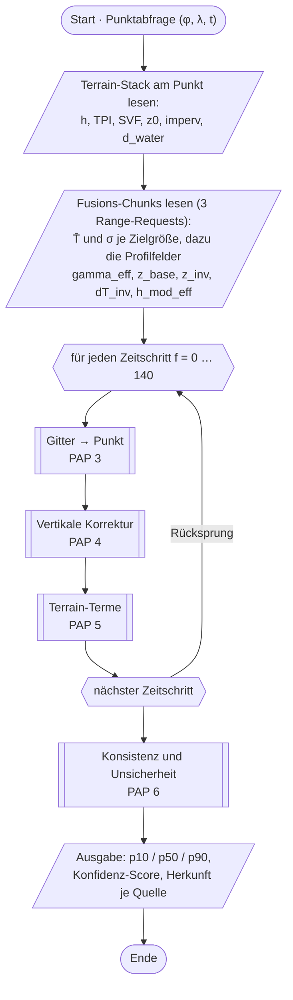
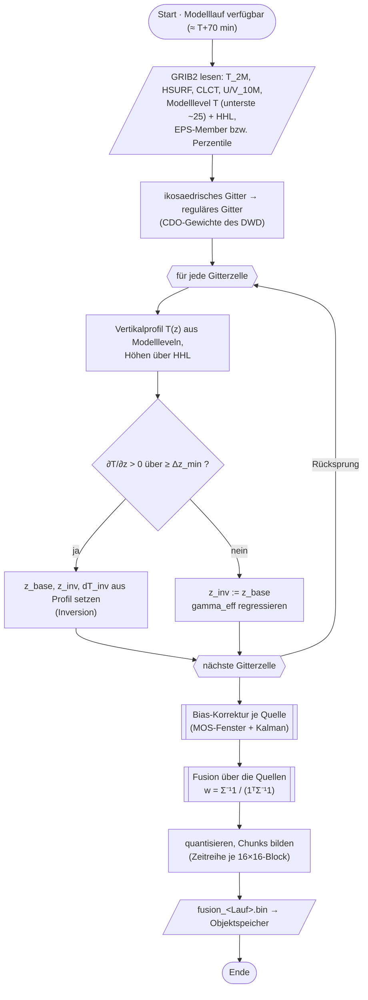
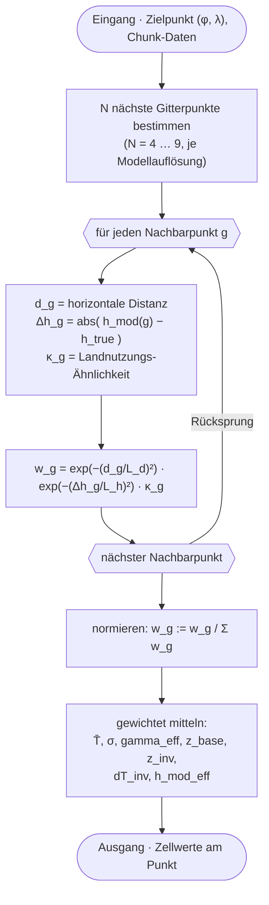
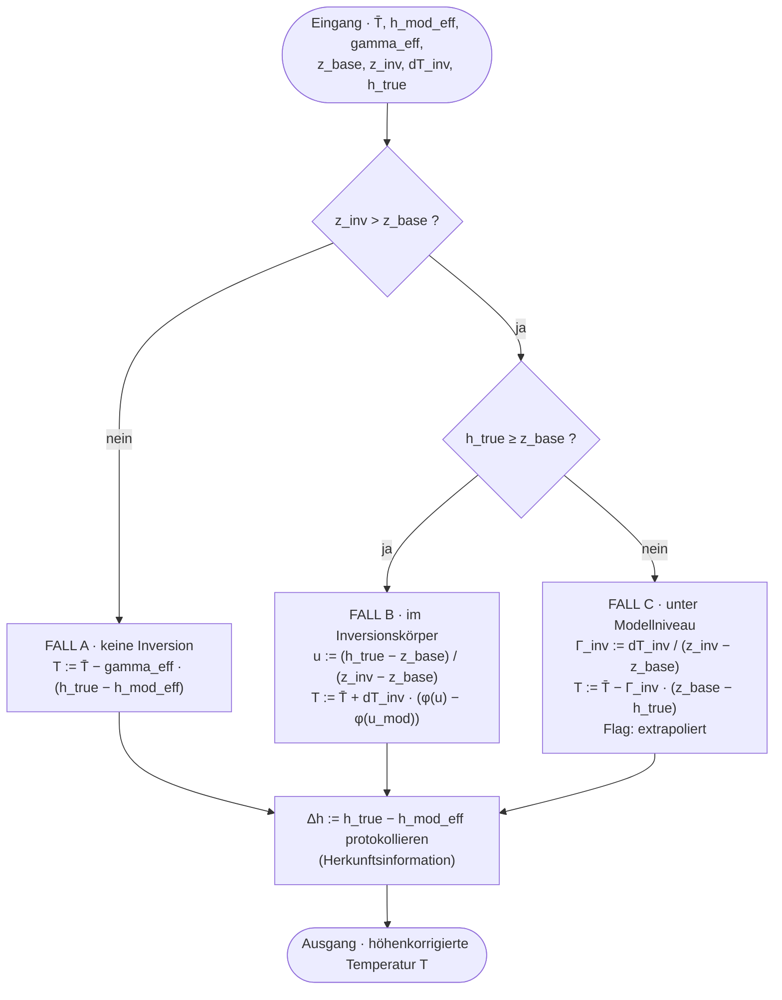
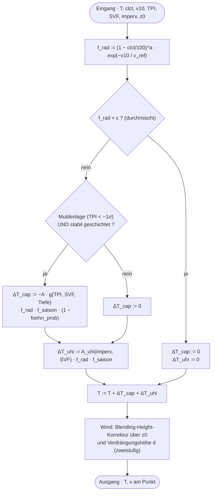
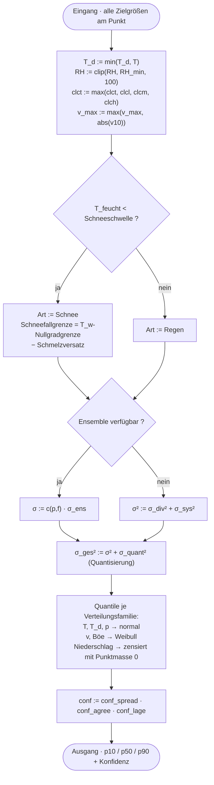

# Programmablaufpläne — Punktvorhersage 0–336 h

**Norm:** DIN 66001 · **Stand:** 2026-09-09 · **Status:** Entwurf, nicht freigegeben

Sechs Ablaufpläne für den Fusions- und Downscaling-Algorithmus: vom Modellgitter
über die vertikale Korrektur bis zu den kalibrierten Quantilen an einem beliebigen
Punkt im DACH-Raum.

> Die Diagramme sind als Mermaid notiert und rendern in GitHub, GitLab und den
> meisten Editoren direkt. Die normgetreue Fassung mit den exakten DIN-Symbolen
> liegt zusätzlich als SVG vor.

---

## Symbole

| DIN 66001 | Bedeutung | Mermaid-Form |
|---|---|---|
| Rechteck mit halbkreisförmigen Schmalseiten | Grenzstelle (Anfang, Ende) | `([Text])` |
| Rechteck | Operation | `[Text]` |
| Rechteck mit doppelten Seitenlinien | Unterprogramm | `[[Text]]` |
| Parallelogramm | Ein-/Ausgabe | `[/Text/]` |
| Raute | Verzweigung | `{Text}` |
| Sechseck | Schleifengrenze (Modifikation) | `{{Text}}` |
| Linie mit Pfeil | Ablauflinie | `-->` |

Ablauflinien verlaufen, wo nicht anders gekennzeichnet, von oben nach unten.

---

## PAP 1 — Hauptablauf der Punktabfrage

Was im Browser passiert, sobald ein Standort angefragt wird. Die drei Range-Requests
holen für jede Auflösungsstufe einen Chunk; der Terrain-Stack liegt nach dem ersten
Aufruf im Cache. Die Schleife läuft über alle 141 Zeitschritte von 0 bis 336 h.

**Zu beachten:** Konsistenz und Unsicherheit laufen bewusst *nach* der Schleife.
Erst wenn alle Zielgrößen heruntergerechnet sind, ergibt eine Prüfung wie
„Taupunkt ≤ Temperatur" überhaupt Sinn.

---

## PAP 2 — Offline-Ingest je Modelllauf

Läuft achtmal täglich in der Ingest-Pipeline, nicht im Browser. Aus dem
Vertikalprofil jeder Gitterzelle entstehen fünf kompakte Hilfsfelder, die der
Client später statt des ganzen Profils bekommt — das ist der Grund, warum das
Latenzziel überhaupt erreichbar ist.

**Zu beachten:** Die Verzweigung prüft `∂T/∂z > 0`, **nicht** `∂θ/∂z > 0`.
Letzteres ist stabile Schichtung und liegt in fast jeder Nacht vor — mit dieser
Schwelle würde der Inversionszweig zum Normalfall statt zum Sonderfall.
Umrechnung: `∂T/∂z > 0` entspricht `∂θ/∂z > (θ/T)·g/c_p ≈ 0,0098 K/m`.

---

## PAP 3 — Gitter → Punkt

Die Interpolation von der Gitterzelle auf die exakte Position. Das Gewicht eines
Nachbarpunkts fällt nicht nur mit der horizontalen Distanz, sondern auch mit der
Höhendifferenz und der Unähnlichkeit der Landnutzung.

**Zu beachten:** Bilineare Interpolation würde im Gebirge einen Gipfelwert ins Tal
ziehen, weil sie nur die Entfernung kennt. `L_d` und `L_h` sind Kalibrierungs­parameter,
keine physikalischen Konstanten.

---

## PAP 4 — Vertikale Korrektur

Der Kern des Verfahrens und die einzige Stelle mit einer echten Fallunterscheidung.
Ob nach oben oder unten gerechnet wird, entscheidet nicht die Höhendifferenz allein,
sondern die Frage, ob eine Inversion vorliegt und wo der Punkt relativ zur
Modelloberfläche liegt.

**Zu beachten:** `φ` ist monoton steigend mit `φ(0) = 0` und `φ(1) = 1` — unten kalt,
oben warm. Startform linear, kalibrierbar gegen Stationspaare in Inversionslagen.
Fall C ist der unsichere Zweig: Der Punkt liegt *unter* der Modelloberfläche, das
Modell kennt diese Senke also gar nicht. Er wird protokolliert und bekommt in PAP 6
ein breiteres Unsicherheitsband.

Vorzeichenkonvention, hier verbindlich: `Γ = −∂T/∂z`. Normale Schichtung → `Γ > 0`,
Inversion → `Γ < 0`.

---

## PAP 5 — Terrain-Terme

Kaltluftsee und Wärmeinsel sind beides Strahlungsnacht-Phänomene. Deshalb steht der
Wetterfaktor `f_rad` ganz vorne: Er entscheidet, ob die geländeabhängigen Terme
überhaupt wirken dürfen.

**Zu beachten:** Zwischen klarer, windstiller Nacht und bedecktem, windigem Wetter
liegt bei der kleinräumigen Spreizung ein Faktor von etwa 3 bis 7. Ohne `f_rad`
wäre eine statische Korrektur nachts zu schwach und tagsüber grob falsch.

Der Faktor `(1 − foehn_prob)` ist nicht kosmetisch: Föhn räumt Kaltluftseen aus.
Ein Verfahren, das gleichzeitig Kaltluftsee und Föhn diagnostiziert, hat einen Fehler.

Die einstufige Windformel `v = v_mod · ln(10/z0_true) / ln(10/z0_mod)` ist **falsch** —
sie liefert über Wasser Faktor 2,35, also +135 % Wind aus dem Nichts. Korrekt ist die
zweistufige Blending-Height-Korrektur mit Verdrängungshöhe.

---

## PAP 6 — Konsistenz und Unsicherheit

Der Abschluss. Erst die harten physikalischen Bedingungen, dann die
Unsicherheitsrechnung, dann die Quantile — je Zielgröße aus einer anderen
Verteilungsfamilie.

**Zu beachten:** Eine Normalverteilung für Niederschlag würde negative p10 erzeugen,
für Wind bei Schwachwind ebenso.

`σ_div` allein unterschätzt systematisch — er misst nur, worin die Modelle sich
unterscheiden, nicht ihren gemeinsamen Fehler. Der Sockel `σ_sys²` aus der
Verifikation ist zwingend. Bei nur einer beitragenden Quelle wird der Nenner von
`σ_div²` exakt null; dort entfällt der Term und `σ_ges² = σ_sys² + σ_quant²`.

`σ_quant² = Δ²/12` mit `Δ` aus Bit-Tiefe und Wertebereich — die Auslieferung führt
selbst einen Fehler ein, und der gehört ins Budget.

---

## Feldglossar

| Feld | Bedeutung | Herkunft |
|---|---|---|
| `T̄`, `σ` | fusionierter Median und Streuung je Zielgröße | Ingest (PAP 2) |
| `gamma_eff` | effektive Abnahmerate `Γ = −∂T/∂z` | aus Modellprofil regressiert |
| `z_base` | absolute Höhe der Inversionsbasis ü. NN | Profilauswertung |
| `z_inv` | absolute Höhe der Inversionsobergrenze ü. NN; `z_inv = z_base` heißt: keine Inversion | Profilauswertung |
| `dT_inv` | Temperaturzunahme von `z_base` bis `z_inv`, positiv | Profilauswertung |
| `h_mod_eff` | effektive Modellorographie des fusionierten Feldes | gewichtetes Mittel der `HSURF` |
| `h_true` | Geländehöhe am Punkt | Copernicus DEM GLO-30 |
| `TPI` | Topographic Position Index, zwei Skalen | Terrain-Stack |
| `SVF` | Sky-View-Faktor | Terrain-Stack |
| `z0` | aerodynamische Rauhigkeitslänge | WorldCover → Davenport-Klasse |
| `imperv` | Versiegelungsgrad | GHS-BUILT-S |
| `f_rad` | Wetterfaktor für Strahlungsnacht-Phänomene | zur Laufzeit |
| `foehn_prob` | Föhnwahrscheinlichkeit | Lee-Geometrie + Modellprofil |

**Alle Bezugshöhen sind absolut über NN**, nicht über Grund. Das Mischen beider
Bezüge ist hier die leichteste Art, sich einen stillen Fehler einzubauen.

---

## Offene Punkte

- Amplituden `A` (Kaltluft) und `A_uhi` (Wärmeinsel) werden an Stationsbeobachtungen
  **gelernt**, nicht gesetzt. Ob genug Stationen in Muldenlagen liegen, ist auszuzählen.
- Sämtliche Startwerte (`L_d`, `L_h`, `Δz_min`, `v_ref`, `a`, `ε`, `z_b`, Schmelzversatz)
  sind Kalibrierungsparameter, keine physikalischen Konstanten.
- Die Schrittfolge ist entworfen, nicht verifiziert. Genauigkeitsaussagen erst nach
  dem Baseline-Lauf.
