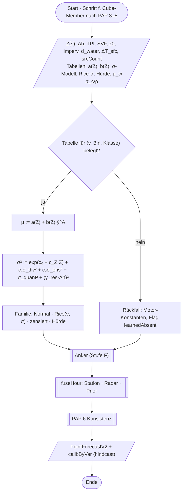
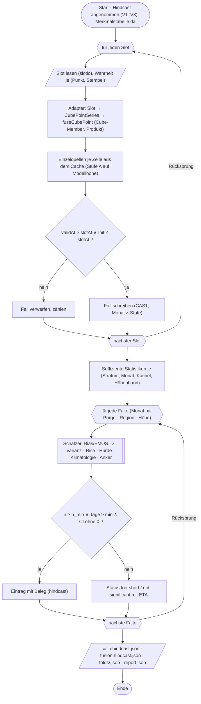
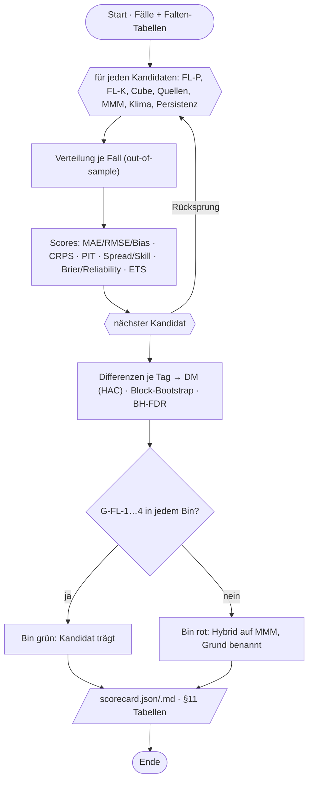

# Phase FL — buscosun Fusion: Lernphase (Bias, Kovarianz, Varianz, Verifikation gegen jede Einzelquelle)

**Stand:** 2026-09-23 · **Status:** Design nach Jans Planungsfreigabe, Umsetzung FL-AP1 ff. läuft · **Linie:** Fortsetzung von
FI (`audit/fusion-implementierung.md`), Vollform (`audit/fusion-vollform.md`) und AP10a (`audit/kalibrierung-fremdarchive.md`) ·
**Referenz:** `ABLAUFPLAENE.md` (PAP 1–6, PAP 7–9 neu), `QUELLENMATRIX.md`, `audit/punktvorhersage-14tage/mathematik-spezifikation.md`

> Jans Auftrag (23.09.): ein Algorithmus, der für jede exakte Position im DACH-Raum 0–336 h liefert und **nachweislich**
> genauer ist als jede Einzelquelle. Datengrundlage: Hindcast (`C:\dev\buscosun-hindcast`) und Punktarchiv
> (`C:\dev\buscosun-archiv`). Die Ablaufpläne und die Quellenmatrix sind Orientierung, keine Vorgabe. Dieses Dokument ist
> Diagnose (§2), Design (§3–§8), Bauplan (§9) und Protokoll (§11) in einem. Keine Genauigkeitsaussage steht hier, bevor die
> Scorecard aus FL-AP4 sie belegt.

## 0 Kurzfassung

- **Was steht:** buscosun Fusion hat den vollständigen Rahmen (PAP 3–8 im Client, `fuseCubePoint` als reine Funktion,
  Verteilungsalgebra, Anker, Fit-Vertrag `calibFit.ts`). **Kein einziger Parameter ist gefittet**; alle Gewichte sind gleich
  („equal weights / fallback"), alle σ-Böden, Längenskalen, Korrelationen und der Wind-Prior sind Setzungen.
- **Was fehlt:** ein Scorer über den Hindcast, Einzelquellen-Werte als Fälle (im Slot nicht enthalten, im Cache je Zelle
  rekonstruierbar), die Lernstufe (Bias je Quelle, Kovarianz Σ, Varianzmodell, gefittete Klimatologie-Dämpfung) und die
  Merkmalstabelle der Standortparameter für die 405 Punkte.
- **Kernentscheidung des Designs:** Physik zuerst (Downscaling je Quelle mit ihrer eigenen Modellhöhe, Γ aus der freien
  Atmosphäre, Inversion, z0-Wind), danach eine **lineare, in Standortmerkmalen parametrisierte Lernstufe** (EMOS-Form), deren
  Koeffizienten ohne Stations-IDs auskommen und deshalb an jedem Punkt gelten. Kein GBM in Stufe 1 (E-FL-2).
- **Zwei Formen der Lernstufe, beide werden gemessen:** die **Einzelquellen-Form P** (nur im Backtest möglich, weil der
  Cube keine Einzelquellen trägt — V-FI-108) und die **Cube-Member-Form K** (im Client heute anwendbar, E-FL-1). Der
  Abstand P − K ist der messbare Preis der Producer-Entscheidung V-FI-108.
- **Ehrliche Grenzen:** Vorlauf 7–48 h nur mit 95 Sommertagen (0 Wintertage); MOSMIX, C-LAEF, INCA, Radar und E4 sind nicht
  im Hindcast; σ_ens nur in t3; Bewölkung nur DE verifizierbar; keine Strahlung, Sonne, Schnee, Sicht in der Wahrheit.
- **Ergebnis (24.09., §11.6, Scorecard 2, out-of-sample über 12,7 Monate, 6,8 M bewertete Fälle):** Form K schlägt in **0–240 h** für
  Temperatur und Taupunkt jede Einzelquelle (−26…−54 % CRPS), das Multi-Modell-Mittel (−29…−39 %), Persistenz, Klimatologie und den
  heutigen Cube (−6…−21 %) signifikant (DM/HAC, BH-FDR), mit Spread/Skill 0,94–1,00 und PIT-Rändern 0,17–0,20; Böe 0–120 h und
  Bewölkung (DE) 0–240 h ebenso. **Nicht erreicht:** 246–336 h (Klimatologie schlägt alles, V-FL-24), Wind ab 51 h (Klimatologie) und
  in der Kalibrierung (PIT-Rand 0,27–0,33, V-FL-22), Niederschlag (gelernte Hürde ≈ Motor-Hürde K-2, der Client behält K-2). Form P
  (Einzelquellen, nur Backtest) liegt 0–4 % vor Form K: der Preis von V-FI-108 ist klein.
- **Diagnose der nächsten Iteration (24.09., §11.8):** Φ-Fehler in den DM-p-Werten behoben (V-FL-25; drei G-FL-1-Zellen kippen: Wind
  25–48 h, Bewölkung 126–240 h, Niederschlag 126–336 h), und sieben Verbesserungen out-of-fold beziffert: Standort × Tagesgang
  (T 0–6 h −7 %), Punktklimatologie als Prädiktor (Wind −3 %, Böe −4…−7 %, 246–336 h auf Klima-Niveau; im Client nur für T ohne
  neues Produkt), Halbmonatsfalten (−1…−3 %), Speed-EMOS für Wind (−3…−4 %, PIT ≈ 0,25), Bewölkungs-σ per CRPS (G-FL-2 grün), Hürde mit
  Cube-Prädiktor, Anker-Kurve (T 24 h −8 %) — Bauplan FL-AP8, Jans Gate E-FL-12/13.

## 1 Anspruch und Prüfkriterium

**Anspruch A (an Stationen):** an den 389 DACH-Punkten mit Wahrheit ist der CRPS des FL-Produkts **je Größe und je
Vorlauf-Bin** kleiner als der jeder Einzelquelle, des Multi-Modell-Mittels (= heutiger Cube), der Klimatologie und der
Persistenz. Einzelquellen werden **auf denselben Punkt mit derselben Höhenkorrektur (Stufe A)** gebracht, sonst vergleicht man
Höhenfehler, nicht Modelle; zusätzlich roh (nächste Zelle + 6,5 K/km, Basislinie B1) als Strohmann. Deterministische
Quellen haben CRPS = MAE; sie werden zusätzlich mit ihrem Residuen-σ „angezogen" (ausgewiesen), damit ein probabilistischer
Vergleich fair ist.

**Anspruch B (weg von Stationen — „exakte Location"):** dieselben Gates unter räumlich geblockter Kreuzvalidierung
(Leave-Region-out über 1°-Kacheln, `blockOf` in `calibFit.ts`) und Höhen-Holdout. Ohne bestandenes B gibt es nur eine
Stationsaussage.

**Signifikanz:** Diebold–Mariano mit HAC über Tagesmittel, Block-Bootstrap über Tage (200 Züge, feste Saat), FDR
(Benjamini–Hochberg, q = 0,05) über die ganze Tabelle. „Nie signifikant schlechter" in irgendeiner Schicht (Höhenband,
TPI-Klasse, Tag/Nacht, Inversion, Land, Route).

**Gates (G-FL):**

| Gate | Kriterium |
|---|---|
| G-FL-1 | CRPSS > 0 (FDR-korrigiert signifikant) gegen jede Einzelquelle in jedem Bin für T, Td, Wind, Böe, Niederschlag; Bewölkung nur DE |
| G-FL-2 | Spread/Skill 0,85–1,20 und PIT-Ränder 0,15–0,25 in jedem Bin (FI §5.4) |
| G-FL-3 | Anspruch B: CRPS unter Leave-Region-out höchstens 10 % über Anspruch A |
| G-FL-4 | keine Schicht signifikant schlechter als das Multi-Modell-Mittel |

Abbruchregeln wie FI §5.6: ein Bin, der G-FL-1 nicht erreicht, bleibt dort auf dem Multi-Modell-Mittel (Hybrid je Bin);
„kalibriert" ohne G-FL-2 ist ein harter Stopp; „Archiv zu kurz" ist ein Status mit ETA, keine Aufforderung nachzujustieren.

## 2 Datenbasis — Diagnose (gemessen, Quellen in Klammern)

### 2.1 Hindcast — Slots je Stufe (`index.json`, Abnahme V1–V8 „pass" vom 23.09.2026)

| Stufe | Slots | Tage | Routen | Quellen (Slot-Zahl) |
|---|---|---|---|---|
| t1 | 1 893 | 2023-05-25 … 2026-09-21 | Tag 0 1 119 · Lauf 774 | icon_d2, icon_ch1_eps, icon_eu, ifs_hres, aifs_single (je 1 893 — „assigned", auch wenn die Quelle am Datum noch fehlt) |
| t2 | 3 614 | 2024-04-01 … 2026-09-21 | dyn 3 227 · Lauf 387 | ifs_hres 3 614, aifs_single 3 614, icon_eu 895, icon_ch2_eps 387, icon_global 387 |
| t3 | 1 806 | 2024-04-01 … 2026-09-21 | dyn 1 614 · Lauf 192 | ifs_hres 1 806, aifs_single 1 806, icon_global 192 |

Gesamt 4 314 Slots, 7,78 GB, 1 216 Tage; Wahrheit 1 217 Tage (2023-05-24 … 2026-09-21).

**Routen und was sie bedeuten (§8 `kalibrierung-fremdarchive.md`):**
- **Lauf** (ab 2026-06-17): ganze Läufe aus Open-Meteo `data_run` (Frist ≈ 3 Monate — jeder nicht gezogene Tag ist verloren);
  t1 8 Slots/Tag mit 0–48 h stündlich, t2 4/Tag 51–120 h 3-stündlich, t3 2/Tag 126–336 h 6-stündlich; alle 5/5/3 Quellen.
- **Tag 0** (t1 vor 17.06.2026): eine zusammengesetzte Analyse-Tagesreihe je Tag, Vorlauf je Quelle **gemessene Annahme**
  0–2 h (3-h-Zyklus) bzw. 0–5 h (6-h-Zyklus), alles im Bin 0–6 h; `leadHours: null`. Quellen wachsen mit dem Datum: ICON-D2 +
  ICON-EU ab 2023-05, IFS ab 2024-01-25, AIFS ab 2025-02-05, ICON-CH1 ab 2025-07-01.
- **dyn** (t2/t3 vor 17.06.2026): dynamical.org IFS-ENS-Kontrolllauf (Member 0) als HRES-Stellvertreter (gegen IFS 0,25°:
  t2m MAE 0,022–0,028 K, V-HC-19) + AIFS; ICON-EU ab 2026-02-10; t3-σ_ens/q10/q90 aus 50 Membern an jeder Stunde (V-HC-8).
  Slots 00/06/12/18 UTC.
- Provenienz durchgängig `hindcast`, nie `measured` (E-F-23). Stellvertreter stehen namentlich im Slot (`standIn`).

### 2.2 Hindcast — Ebenen mit Werten je Route (Stichproben 2026-09-20/0000, 2025-12-15/0000, 2024-06-01)

| Route / Stufe | Ebenen mit Werten | Leer (namentlich in `empty`) |
|---|---|---|
| Lauf t1 | 29: t2m/td2m/u10/v10/gust/precip/clct/ps/snowlmt (+ `_sd`), clcl/clcm/clch, hModEff, t925/t850/t700, rh925/850/700, srcCount | alle `_sd_ens`, q10/q90, **gammaEff/zBase/zInv/dTInv**, ensCount |
| Lauf t2 | 28 (ohne snowlmt_sd) | wie t1 |
| Lauf t3 | 40: zusätzlich `_sd_ens`/q10/q90 für t2m, u10, v10, precip + ensCount | td2m/gust/clct/ps-Ensemble, snowlmt*, Profil |
| Tag 0 t1 | 29 wie Lauf | wie Lauf |
| dyn t2 | 18: t2m/td2m/u10/v10/clct/ps (+ `_sd`), gust, precip, hModEff, t925/t850, srcCount | clcl/clcm/clch, t700/rh*, snowlmt, gust_sd, precip_sd |
| dyn t3 | 32: wie dyn t2 + Ensemble-Ebenen + ensCount | — |
| dyn t2 (2024-06) | 15 | kein gust, kein clct |

Folgen: **das Profil (Γ, Inversion) fehlt im Hindcast überall** — Stufe A rechnet Γ aus 925/850/700 hPa (Lauf/Tag 0) bzw.
925/850 (dyn), und PAP 4 läuft im Fallbau wie das Produkt ohne Profil, im Fall gekennzeichnet. **σ_ens nur t3.**
Speicherauflösung (V-HC-5): t2m 0,05 K, Druckflächen-T 0,11–0,15 K, Wind 0,1 m/s, RH 1 % ⇒ Γ-Rauschen ≈ 0,07 K/km zwischen
850 und 700 hPa; geht als σ_quant in Stufe D ein.

### 2.3 Hindcast — Wahrheit (`truth\<Tag>.json.gz`, stündlich; Abdeckung = Anteil belegter Stunden im Fenster 2025-09 … 2026-09, 386 Tage, aus `verify\2026-09-23.json` V5coverage)

| Netz | Punkte | t / td / rh | ff / dd | fx / fxh | rr1 | rr1h | n (Bewölkung) | p |
|---|---|---|---|---|---|---|---|---|
| DE `cdc` (steht für POI) | 203 / 203 | 0,994 | 0,987 | 0,869 | 0,854 | — | 0,939 | 0,903 (reduziert) |
| AT `tawes` | 84 / 84 | 0,997 | 0,984 | 0,984 | 0,985 | 0,984 | — | 0,966 (PRED, an Bergstationen auf 1 500/3 000 m reduziert) |
| CH+LI `smn` | 102 / 102 | 0,969 | 0,988 | 0,988 | 0,929 | 0,929 | — | **0,451** (an ≈ 56 Stationen leer) |

Regeln: rr1 = 10-min-Wert × 6 (Rate), rr1h = Sechsersumme (AT/CH); DE CDC `RR` ist die Stundensumme; `fxh = fx` bei CDC;
AT td/p vor 2026-06-19 Magnus-abgeleitet (V-HC-15, Flag `truthDerived`); `n` = V_N × 12,5 %, nur DE. **Nirgends:**
Stationsdruck `ps` (erst Archiv-Schema 3), Globalstrahlung, Sonnenschein, Schneehöhe/Neuschnee, Sicht, Wetterzustand,
Bewölkung AT/CH. CDC ↔ POI: t/p/rr1 exakt gleich, td/rh/ff/dd/fx/n innerhalb der Produktrundung (V5). Die 16 Nachbarpunkte
(CZ 9, NL 4, DK 1, LU 1, SK 1) haben keine Wahrheit (V-HC-22).

### 2.4 Punkte (`scripts/punktarchiv/points.json`, 405; 389 DACH)

| Land | Punkte | Netz | < 500 m | 500–1000 | 1000–1500 | 1500–2000 | ≥ 2000 |
|---|---|---|---|---|---|---|---|
| DE | 203 | POI/CDC | 164 | 34 | 4 | 0 | 1 |
| AT | 84 | TAWES (13 auch POI) | 37 | 27 | 9 | 5 | 6 |
| CH | 101 | SMN (5 auch POI) | 36 | 28 | 14 | 13 | 10 |
| LI | 1 | SMN + POI | | | | | |

Median 419 m, 35 Punkte über 1 500 m, 17 über 2 000 m (kleine Stichprobe für Anspruch B im Hochgebirge). `elev` = Stationshöhe
= h_true (E-F-12), `demM` als Kontrolle (Gipfelstationen bis 270 m Abweichung).

### 2.5 Hindcast — Zellen, Orographie, Radiosonden

- `cells\tX.json`: je Cube-Zelle `hmodel[source]` (gepinntes `static/hmodel`-Produkt, Commit `beedc23b…`) und das Rezept
  je Quelle (`producer[[j,i]]`, `store[[r,c]]`, `via block|fill|nearest`); ICON-CH ohne hmodel (V-FI-105-Familie); Zellen
  t1 1 384, t2 1 361, t3 914. Slot-`hModEff` = Mittel der Höhen der beitragenden Quellen — **derselbe Quellmix-Sägezahn
  wie im Cube (V-FI-104)**, aber hier je Quelle auflösbar.
- Einzelquellen je Zelle: nicht im Slot, aber im Cache über `scripts/hindcast/lib/recompute.mjs` (`sourceCellValue`,
  `recipeValue`) bzw. die producer-treuen Leser in `build-slots.mjs` — Block-Mittel float32 wie der Producer, Bewölkung nur
  0…100 % (V-HC-30), Niederschlag als Rate aus dem Schrittraster der Quelle, td Magnus, ps barometrisch, wo nicht gespeichert.
- IGRA2: 19 Stationen (DE 14, AT 4, CH 1), 2023-05-24 … 2026-09-17, meist 00/12 UTC; ohne RH (V-HC-17). Nutzung: Prüfung des
  Γ-Schätzers (Stufe A) gegen gemessene Profile, nicht als Prädiktor.

### 2.6 Punktarchiv (`buscosun-archiv`)

9 Slots, 2026-09-14 … 09-22 (Schema 1 bis 17.09., Schema 2 ab 18.09.; Schema 3 im Code, noch kein Slot), ≈ 10,6 bzw.
18,5 MB je Slot, 405 Punkte. Trägt, was der Hindcast nicht hat: Cube-Ebenen **mit Profil** (gammaEff/zBase/zInv/dTInv, t1),
`_sd_ens` in t1/t2 (ICON-D2-EPS, CH-EPS), MOSMIX-L an der Katalogstation (247 h), Nowcast-Frames (RV/INCA/CombiPrecip),
`hmodel` je Quelle und Slot, Plan, Live-Pfad (`fields`, `fusion`), Wahrheit 25 h (POI 238 Punkte, TAWES 84, SMN 102),
ab Schema 3 `ps`. Zu kurz für einen 12-Monats-Test; die Baselines B2 (MOSMIX-L), B5 (Live-Pfad), B6 (alte Fusion) und der
Nowcast-Anteil 0–3 h werden **nur** hier gemessen (E-FL-4), als eigene, wachsende Reihe.

### 2.7 Lückenliste (jede mit Folge)

| Lücke | Beleg | Folge für Design und Aussage |
|---|---|---|
| Vorlauf 7–48 h nur Lauf-Route: 95 Tage, **0 Wintertage** | §8.7 `kalibrierung-fremdarchive.md` | Bins 7–24 / 25–48 h gelten bis zum Winter-Nachfit (FL-AP7, ab Dezember) nur für Sommer/Herbst; so ausgewiesen (E-FL-3) |
| MOSMIX, C-LAEF(-EPS), ICON-D2-EPS, INCA, RV/RZC, E4 nicht im Hindcast | `index.json` Quellen; `assignedAbsent` | Einzelquellen-Baselines des 12-Monats-Tests = die 7 Rohmodelle (E-FL-4); Nowcast 0–3 h und Stationsprodukt nur im Archiv-Fenster |
| σ_ens nur t3 (IFS-ENS) | §2.2 | c₂ nur t3; t1/t2 Varianz aus σ_div + Standortmerkmalen |
| kein Profil (Γ, Inversion) im Hindcast | §2.2 | Stufe A rechnet Γ aus Druckflächen; φ/poolDepth/dzMin bleiben `fittable:false` bis Archiv-Winterfälle |
| Wahrheit ohne Strahlung/Sonne/Schnee/Sicht/Wetterzustand; Bewölkung nur DE; `ps` erst Archiv-Schema 3 | §2.3 | keine Aussage zu Strahlung; Bewölkung DE-only; Phase (meltOffset) nur aus Archiv-POI-Spalten ab Schema 4 (V-FI-76) |
| SMN `p` an 56/102 leer; TAWES PRED an Bergstationen reduziert | §2.3, PA4 | Druck nur diagnostisch, CH-Druck nicht bewertet |
| Speicherrundung Open-Meteo | V-HC-5 | σ_quant je Ebene in Stufe D; Γ-Rauschen ≈ 0,07 K/km |
| Open-Meteo-Zellen ≠ Cube-Zellen (Blockmittel; V4: t1 t2m MAE 0,26 K gegen den Cube) | V4 `shadow\latest.json` | Aussagen gelten für die Hindcast-Form des Cubes; Archiv-Fenster misst den echten Cube (FL-AP6) |
| Tag-0-Vorlauf ist gemessene Annahme, keine Zusage | V-HC-20 | Bin 0–6 h nach Route geschichtet; Stunde 0 (validAt = slotAt) verworfen |
| 16 Nachbarpunkte ohne Wahrheit | V-HC-22 | ausgeschlossen |
| dynamical-Zugang ändert sich 30.09.2026 | `QUELLENMATRIX.md` §6 | Folgekette vor dem Stichtag prüfen (Jans Maschine) |
| `CalibProvenance` kennt kein `hindcast` | `src/point/calibDoc.ts` | V-FL-1: FL-AP1 ergänzt es; Leser kennzeichnet `hindcast` im Produkttext |

## 3 Algorithmus — Stufen A–G

Notation: Punkt s mit Standortmerkmalen **Z(s)** (§4), Vorlauf τ (Bin b ∈ `CALIB_BINS_H`), Quelle m ∈ M(t) (zeitabhängige
Menge), Größe v. Jede Zahl trägt Herkunft `physical` / `literature` / `set` / `hindcast` / `measured`; nur `measured`
wirkt stillschweigend, `hindcast` wird im Produkt genannt (E-F-23).

### 3.1 Stufe A — physikalisches Downscaling je Quelle (deterministisch, vor jeder Statistik)

**A1 Höhenreduktion je Quelle mit ihrer eigenen Modellhöhe.** Für jede Quelle m an der Zelle c:
`T_m(s) = T_m(c) + P_m(h_true) − P_m(h_mod,m)` mit `h_mod,m` aus `cells\tX.json hmodel[m]` (Hindcast) bzw. `static/hmodel`
(Cube) und der stückweisen Profilfunktion `P_m` aus `vertical.ts` (Fall A/B/C). Quellen ohne Höhe (CLAEF, AICON, ICON-CH
im Hindcast) bekommen die Stellvertreter-Orographie der Quelle gleichen Gitters mit Provenienz `proxy` (V-FI-105) — im Fall
gekennzeichnet (`hmodelFallback`). Das beseitigt den Quellmix-Sägezahn **vor** dem Mittel (V-FI-104, Kur (b)).

**A2 Γ_eff aus der freien Atmosphäre, ohne den 2-m-Punkt (AP15-Lehre).** t1 mit Profil (Archiv/Cube): `gammaEff` des
Producers aus Modellleveln. Ohne Profil (Hindcast, t2/t3): hypsometrische Höhen der Flächen 925/850/700 hPa
(`profileColumn.ts`, `pressureProfileFromCell`, Regel E-F-14: Flächen ≥ 10 hPa über Grund, gammaDepth 1 500 m), Γ als
Kleinste-Quadrate-Steigung **nur über die Flächen** (Variante V-e aus AP15: ohne 2-m-Punkt 1,37 K gegen 1,39 K
Standard-Lapse — gleichwertig, nicht besser), geklemmt [−8, +12] K/km (`literature`, Paper Gl. 6). **Der Fit entscheidet
per Kreuzvalidierung**, ob Γ_frei oder 6,5 K/km die bessere Basis für Stufe B ist — je Bin, Tag/Nacht (Ablation in FL-AP3).
Inversion (dT_inv > 0,5 K über ≥ 50 m) wie `vertical.ts` Fall B/C mit Γ_inv-Deckel (V-FI-15); φ linear bis Winterfälle.

**A3 Entkopplung der 2-m-Schicht als Prädiktor, nicht als Extrapolation.** `ΔT_sfc,m = T2m,m(c) − T_prof,m(h_mod,m)`
(2-m-Wert minus Profilwert an der Modellhöhe). AP15 hat gezeigt, dass dieser Wert nachts nicht die Luftsäule beschreibt,
sondern die lokale Bodenschicht der Modellzelle; er ist deshalb ein **Merkmal** für Stufe B (wie stark koppelt das Modell
nachts ab), keine Größe, die man auf h_true fortsetzt.

**A4 Gitter → Punkt** (`grid.ts`): 2×2-Block, `w = exp(−(d/L_d)²)·exp(−(Δh_m/L_h)²)·κ`, Δh_m gegen die **Höhe der Quelle**
je Zelle; L_d, L_h, λ_κ per CRPS-Gittersuche (Registry `Ld/Lh/kappaLambda`, heute `set` 200 m / Zellweite / 1).

**A5 Taupunkt:** Höhenreduktion mit `DEWPOINT_LAPSE_PER_M` (heute `set` 1,8 K/km) → Fit als eigener Koeffizient in Stufe B
(Δh-Term); Konsistenz Td ≤ T bleibt in PAP 6.

**A6 Wind:** Komponenten u, v je Quelle; zweistufige Blending-Höhen-Korrektur (`windBlendingFactor`, z0_mod → z_b → z0_true, d0),
z_b per Gittersuche (Registry `zBlend`, heute `set` 60 m); GRIB-z0 (`z0mod`, AP17) nur, wenn der Fit es gegen WorldCover-z0
belegt (V-FI-100: Faktor 1,5–5). TPI-Abschirmung/Beschleunigung (`windTerrainFactor`) als Merkmal in Stufe B, nicht mehr als
Setzung.

**A7 Niederschlag, Bewölkung, Böe, Druck:** keine Höhenreduktion für Niederschlag und Bewölkung (orographische Verstärkung
lernt Stufe B über Hangneigung × Exposition); Böe wie Wind; Druck hydrostatisch auf Stationshöhe (diagnostisch).

### 3.2 Stufe B+C — Lernstufe: Mittelwert in EMOS-Form mit Kovarianz-Prior

**Form P (Einzelquellen; Backtest und spätere Producer-Form):** je Größe v, Bin b, Quellenklasse q (= vorhandene Quellenmenge,
`srcMask`):

`μ = a(Z) + Σ_m b_m(Z_m) · ŷ_m^A`

- `a(Z) = α₀ + αᵀZ + Harmonische(Tageszeit K=2, Jahreszeit J=2)` — der ortsabhängige Bias, linear in den Standortmerkmalen.
- `b_m(Z_m) = β_m0 + β_m1·Δh_m + β_m2·ΔT_sfc,m` — das Quellgewicht mit zwei quellspezifischen Modulatoren (Höhenabstand,
  Entkopplung). Mehr Interaktionen trägt n_eff nicht (Mathe-Spec §4.2: ≈ 2 200 unabhängige Fälle je Bin und Jahr).
- Schätzung: Ridge-Regression in standardisierten Merkmalen mit **Shrinkage-Ziel = Minimum-Varianz-Gewichte**
  `w = Σ⁻¹1/(1ᵀΣ⁻¹1)` aus der gemessenen Fehlerkovarianz Σ(v, b, q) der bias-korrigierten Quellen (Stufe C in `combine.ts`,
  Shrinkage λ_Σ gefittet statt 0,85). Das heißt: ohne Beleg fallen die Gewichte auf die BLUE-Kombination zurück; mit Beleg
  dürfen sie davon abweichen (Amplitudenkorrektur, Regressionsdämpfung mit dem Vorlauf). Ridge-λ per geblockter CV aus
  {0,1; 1; 10; 100}. Koeffizienten, deren 90-%-Bootstrap-Intervall die Null enthält, werden 0 gesetzt (Beleg im Eintrag).
- Quellen fehlen zeitabhängig (AIFS ab 02/2025, ICON-EU-dyn ab 02/2026, ICON-CH ab 07/2025) ⇒ je Klasse q eigener Fit;
  Klassen mit zu wenig Tagen fallen auf die Σ-Gewichte der nächstgrößeren Klasse zurück (Teilmatrix).

**Form K (Cube-Member; Client heute, E-FL-1):** der Cube trägt nur das gleichgewichtete Mittel `ȳ`, `σ_div`, `srcCount`,
`hModEff`:

`μ = a(Z) + (β₀ + β₁·Δh + β₂·ΔT_sfc + β₃·srcCount-Klasse) · ȳ^A`

mit `ȳ^A` = Cube-Member nach PAP 3–5. Form K kann den Sägezahn V-FI-104 nur als Bias je `srcCount`-Klasse lernen, nicht
beseitigen. **Beide Formen werden im Backtest gemessen; P − K ist der Beleg für V-FI-108** (Punktauszug je Quelle aus dem
Producer oder PAP 2 im Producer).

**Warum EMOS-Form und nicht nur Σ-Gewichte:** Σ-Gewichte allein (Summe 1) können weder Amplitudenfehler noch die
Vorlauf-Dämpfung zur Klimatologie abbilden; die EMOS-Form mit Intercept `a(Z)` und freien `b_m` ist der lineare
Bayes-Schätzer mit Klimatologie als Grenzfall (Σ b_m → 0). Die Σ-Gewichte bleiben als Prior und als Diagnose (implizite
Gewichte, effektive Memberzahl) im Beleg.

### 3.3 Stufe D — Varianzmodell (je Größe, Bin, Familie)

`σ² = exp(c₀ + c_ZᵀZ_klein) + c₁·σ_div² + c₂·σ_ens² + σ_quant² + (γ_res·|Δh|)²`, `Z_klein = {|Δh|, TPI2000, SVF}` — vier freie
Koeffizienten plus c₁, c₂ (c₂ nur t3). Schätzung per CRPS-Minimierung (Gitter in log-Raum, Golden-Section-Verfeinerung; Loss
aus Gruppen-Partialsummen, deshalb faltenweise additiv). Ersetzt `C_SPREAD = 1`, die σ_sys-Böden aus V-A₁ und den
Höhenrest 0,0035 K/m (`set`) durch gemessene Werte je Bin.

Familien (`dist.ts`): T, Td, ps **Normal**; Wind **Rice**(ν = |(μ_u, μ_v)|, σ_komp) mit σ_komp aus CRPS auf ff — **das ist die
Kur für V-FI-107** (heute `windSigmaAt` 3,2 m/s + Höhe/TPI, Rice-Mittel σ√(π/2) ⇒ 5,1 m/s bei 150–240 h); Böe **zensierte
Normal** ≥ Wind; Bewölkung **zensierte Normal** [0, 100]; Niederschlag **hurdleLogNormal**: Auftritt
`P(y ≥ 0,1 mm/h) = logistic(α + β₁·ln(1+P̄) + β₂·Anteil nasser Quellen + β₃·ln(1+σ_div) + β₄·ln(1+q90) [t3] + Saison)` per
IRLS, Menge `ln(y | nass) ~ N(a + b·ln(1+P̄), s²)`; zusätzlich Quantilregression 0,1/0,5/0,9 (Pinball) als parameterfreie
Diagnose. Gates: Spread/Skill 0,85–1,20, PIT-Ränder 0,15–0,25.

### 3.4 Stufe E — Klimatologie (Dämpfung und Rückfall)

`μ_c(s, doy, h)`, `σ_c(s, doy, h)` **stündlich** aus 3 Jahren Wahrheit je Punkt per harmonischer Regression (Jahresgang K=2,
Tagesgang J=2 mit jahreszeitabhängigen Amplituden; für stationslose Punkte aus `climaGrid` + Höhen-/Merkmalsregression der
Stationskoeffizienten — Anspruch B). `ρ(τ)` je Größe, Höhenband, Land als Autokorrelation der Anomalie-Vorhersagefehler.
Die EMOS-Form (3.2) dämpft von selbst (Σ b_m → 0 mit τ); Stufe E bleibt (a) Rückfall für Bins/Größen ohne Fit, (b) Schwanz
jenseits des letzten nativen Schritts, (c) Konsistenzprüfung: die gefitteten Σ b_m müssen wie ρ(τ) fallen (sonst Überanpassung).
Das behebt V-PV-18 (σ_c aus dem Tagesmittel und ρ₀ 0,985 waren die Ursache der 2×-Überkonfidenz in V-A₁).

### 3.5 Stufe F — Stationsanker

`anchor.ts` bleibt (Innovations-Persistenz): τ_v, Kappen und Altersgewicht werden aus dem Hindcast geschätzt — Innovation
`o − μ` zur Slotstunde gegen den Fehler bei τ an derselben Station: `ρ_anchor(τ) = corr(e₀, e_τ)`, Gewicht `= ρ_anchor·σ_τ/σ₀`.
Heute `set` (T 4 h, Wind 2 h; Kappen 8 K / 6 m/s).

### 3.6 Stufe G — Geländeterme (PAP 5) und Föhn

A, A_uhi, f_rad(a, v_ref, ε) aus Nachtfällen (Registry `A/Auhi/fRad.*`, Kleinste Quadrate mit Bootstrap); tpiSigma regional
(DE 22,6 · AT 117,1 · CH 135,0 m statt gepoolt 104,6 — V-FI-98). In der EMOS-Form sind gCap·f_rad und gUhi·f_rad Merkmale von
a(Z); die separaten Amplituden bleiben für den Live-Pfad. Föhn: heute Heuristik (`foehnDetector`, Schwelle 0,6, null nördlich
49,2 °N); im Design zusätzlich der **Druckgradient über dem Alpenkamm** aus `ps` der Cube-Zellen (Nord–Süd-Differenz auf
gleiche Höhe reduziert) als Merkmal; ob er trägt, entscheidet der Fit (E-FL-6).

### 3.7 Laufzeit-Kette (Client, Form K) und Ausgabe

Je nativem Schritt: PAP 3 → PAP 4 (je Quelle nicht möglich: Cube-Member mit hModEff) → PAP 5 → **Lernstufe K** (a(Z), b(Z),
σ-Modell, Wind-Rice-σ, Niederschlags-Hürde) → Anker (F) → `fuseHour` mit MOSMIX-Station, Radar, Prior (Gewichte zwischen
diesen Membern aus dem Archiv-Fenster, FL-AP6, bis dahin Motor-Priors) → PAP 6 Konsistenz → `PointForecastV2`. Alles hinter
`FuseCubeOptions.learned` (voreingestellt aus), ohne Option byte-gleich. `calibByVar` nennt `hindcast`-Provenienz.
Stufe 2 (nicht jetzt): Quantil-GBM/DRN auf den Residuen ab ≥ 2 Jahren Archiv; Schaake-Shuffle für Kohärenz.

## 4 Statische Standortparameter

| Merkmal | Quelle / Auflösung | Funktion | Herkunft | Mängel / Befund |
|---|---|---|---|---|
| h_true | Stationshöhe (≤ 250 m), sonst Terrarium z11 | `resolve.ts` E-F-12, `terrain.ts` | measured | DEM vs. Station bis 270 m an Gipfeln |
| h_mod je Quelle | `static/hmodel` (Cube), `cells\tX.json` (Hindcast) | `staticPoint.ts`; **wird von `cubeInputFromBundle` nicht durchgereicht** | measured | V-FL-3; CLAEF/AICON/ICON-CH ohne Höhe (V-FI-105) |
| Hangneigung, Exposition | Terrarium z11, 90-m-Schritt | `slopeAspect` | measured | — |
| SVF | 8 Azimute, z11 nah / z8 fern | `skyViewFactor` (Dozier) | measured | — |
| TPI 500 / 2000, Muldentiefe | z11 / z8 | `tpiAt`, `sinkDepthM` | measured | tpiSigma regional (V-FI-98) |
| z0_true, z0_mod, Klassen-Anteile, κ | WorldCover 10 m → Davenport | `z0Point.ts`, `landCover.ts` | literature (Tabelle) | GRIB-z0 1,5–5× höher (V-FI-100); Spiegel ≈ 37 m (V-FI-75) |
| d_water | WorldCover, Ringsuche A_min 10 px, zensiert 20 km | `dWaterFromWindow` | measured | findet Teiche/Fluss-Stücke (V-FI-94) ⇒ zusätzlich `dLakeM` (≥ 1 km²) |
| imperv, d0, bldgH | GHS-BUILT-S/H 100 m, `static/urban/v1` | `readUrbanPoint` | measured | imperv = Gebäudeanteil, Straßen fehlen (Producer-Kommentar) |
| Föhn-Index | Heuristik + (neu) Kamm-Druckgradient | `foehnDetector`, Stufe G | set / hindcast | Lee-Geometrie bewusst nicht (FI §7.3) |
| ΔT_sfc | je Quelle aus Profil | Stufe A3 | hindcast | nur mit Druckflächen/Profil |
| Radiosonde nächste | IGRA2, 19 Stationen | Prüfung Γ | measured | ohne RH |

Für den Backtest entsteht **eine** Merkmalstabelle der 405 Punkte (`features\points.v1.json`, Kopf mit codeHash,
WorldCover-SHA, Zellen-Commit); ihr Hash steht in jedem Fit-Beleg.

## 5 Fit-Protokoll

1. **Fälle** je (Slot, Stufe, Punkt, nativer Schritt): Schlüssel (slotAt, validAt, lead, Punkt, Route, srcMask, Netz,
   Wahrheits-Flags), Wahrheit (8 Größen), Cube-Member nach PAP 3–5 (μ, σ-Teile, Fall, Δh, Gitterwichte, Flags), gefusioniertes
   Produkt (Verteilungsparameter, q10/50/90), Cube-Ebenen (σ_div, σ_ens, srcCount, hModEff), **Einzelquellen roh auf
   Modellhöhe** (nächste + 3 Blockzellen). Container `CAS1`, je (Monat, Stufe) eine Datei; ≈ 85 M Zeilen, 5–7 GB gz.
2. **Leck-Wächter:** validAt > slotAt; jede Quell-Initialisierung ≤ slotAt; Stunde 0 der Tag-0-Slots verworfen; Wahrheit nur
   aus `truth\` (nie aus dem Slot); Negativkontrolle: um −1 h verschobene Wahrheit muss den CRPS bei h = 1 brechen.
3. **Deduplikation:** Schlüssel (Punkt, Stempel); doppelte Stunden (Archiv: 23 UTC) müssen gleich sein.
4. **Schichtung:** Größe × Bin × Quellenklasse; Bericht zusätzlich Tageszeit, Saison, Höhenband (< / ≥ 800 m, 3 Bänder),
   TPI-Klasse, Land, Route, Inversion (Archiv-Fälle).
5. **Kreuzvalidierung:** Zeitfalten = Kalendermonate mit 15 Tagen Purge beidseits (Vorlauf bis 14 d); Leave-Region-out über
   die 12 stärksten 1°-Kacheln; Höhen-Holdout in beide Richtungen. Regularisierung nur auf den Trainingsfalten gewählt.
   Out-of-sample-Vorhersagen für den Scorer aus je Monat getrennt gefitteten Tabellen.
6. **Suffiziente Statistiken je (Stratum, Monat, Kachel, Höhenband)** — ein Durchlauf über die Monatsdateien; eine Falte ist
   die Summe der Trainingsgruppen. Speicher ≤ 1 GB je Worker.
7. **Beleg je Eintrag:** n, Tage, Zeitraum, Schätzer, Strata, 90-%-Intervall, CV-Gewinn, fitVersion, Merkmalstabellen-Hash;
   `CALIB_N_MIN` und Mindesttage wie `calibDoc.ts`; Status `too-short` mit ETA statt Wert.
8. **Ausgabe:** `fit\<datum>\calib.hindcast.json` (bestehende Pfade, Schema 2, Provenienz `hindcast`, muss
   `validateCalibDocument` bestehen) und `fusion.hindcast.json` (Koeffizientenblöcke `bias`, `cov`, `variance`, `wind`,
   `precip`, `clima`, `anchor`); Client-Leser in FL-AP5 (Schema-Bump 3, E-FL-5); Publisher-Weg = Jans Gate (E-F-20).
9. **Nie Archiv und Hindcast in einem Fit mischen** (E-F-23/28); das Archiv-Fenster ist eine eigene Reihe.

## 6 Verifikation

- **Zeitraum:** 2025-09-01 … 2026-09-21 (386 Tage), Out-of-sample per §5.5; zusätzlich Archiv-Fenster ab 14.09.2026.
- **Kandidaten:** FL-P, FL-K, heutiger Cube (equal weights, `FuseCubeOptions`-Voreinstellungen), Cube + Anker, jede
  Einzelquelle heruntergerechnet (Stufe A) und roh (B1), Multi-Modell-Mittel, Klimatologie (Stufe E), Persistenz und
  Anomalie-Persistenz; im Archiv-Fenster B2 MOSMIX-L, B5 Live-Pfad, B6 alte Fusion.
- **Metriken je Größe × 6 Bins × Schicht:** MAE/Bias/RMSE; CRPS/CRPSS gegen jede Baseline; PIT-Histogramm und Randanteil;
  Spread/Skill; Brier + BSS + Reliability (10 Klassen) an Schwellen Niederschlag 0,1/1/5 mm/h, T < 0 °C, Böe > 14 m/s,
  Wind > 8 m/s; **ETS** an denselben Schwellen (Ereignis = q50 über Schwelle bzw. p > 0,5, beides ausgewiesen). **FSS ist an
  Punkten nicht definiert** (keine Nachbarschaft); ersatzweise ETS mit zeitlichem Fenster ±1 h, so beschriftet.
- **Tests:** DM mit HAC auf Tagesmitteln der Score-Differenzen, Block-Bootstrap über Tage (200), BH-FDR über die Tabelle;
  roh und korrigiert berichtet.
- **Ausgabe:** `score\<datum>\scorecard.{json,md}` und Kopie `audit/fusion-lernphase/scorecard-<datum>.json`; Tabellen in §11.
- Wind jenseits 72 h nur mit gefittetem Rice-σ bewertet (bis dahin als verzerrt gekennzeichnet, V-FI-107).

## 7 Wo die Datenlage die Genauigkeit nicht hergibt

Winter 7–48 h (0 Tage; Nachfit ab Dezember) · 0–3 h Nowcast-Anteil (Radar/INCA nur Archiv) · Bewölkung AT/CH (keine
Beobachtung) · Strahlung/Sonnenschein (keine Beobachtung, keine Aussage) · Schnee/Phase (nur Archiv-POI-Spalten ab Schema 4)
· Böen t3 (kein σ_ens, AIFS ohne Böe) · Druck CH (SMN `p` 45 %) · Hochgebirge > 2 000 m (17 Punkte) · MOSMIX-, C-LAEF-,
E4-Baselines (nicht im Hindcast) · φ, poolDepth, dzMin (Winterfälle mit Profil, Modelllevel nicht archiviert) · d_water als
Seenähe (V-FI-94) · Versiegelung als Straßenanteil (GHS-BUILT-S zählt Gebäude) · Anspruch B im Hochgebirge (Stichprobe).

## 8 Programmablaufpläne (DIN 66001, Symbole wie `ABLAUFPLAENE.md`)

### PAP 7 — Lernstufe zur Laufzeit (Form K, je nativem Schritt)

### PAP 8 — Fit aus dem Hindcast

### PAP 9 — Verifikation und Gates

## 9 Arbeitspakete und Bauplan

| AP | Inhalt | Gate |
|---|---|---|
| FL-AP1 Fundament | `CalibProvenance += 'hindcast'`, `validateCalibDocument`/`calibOverridesFrom` (E-F-23), `FitOptions.provenance/source`, Exporte `bootstrapDays/blockOf/lcg`; `scripts/fusionfit/lib/diskCache.mjs` (`CacheBackend` auf Platte); `features.mjs` → `features\points.v1.json`; `scripts/verify-fusion-fit.mjs` Grundgerüst | `verify:fusion-fit` neu, `verify:calib-fit` 14/14, typecheck |
| FL-AP2 Fallbau | Exporte `accessorsFor/makeSource/planDay0` aus `build-slots.mjs` (byte-gleich); `lib/slotAdapter.mjs`, `lib/perSource.mjs`, `lib/truthJoin.mjs`, `lib/casesio.mjs` (CAS1), `build-cases.mjs` (4 Worker, `detach.ps1`) | V-FF-1 Rekombination = Slot-Ebene (Δ/2, 1 %), V-FF-2 Motor am Adapter = Motor an `pvCubeFixtures`, V-FF-3 Leck-Negativkontrolle, V-FF-4 Zeilenzahl |
| FL-AP3 Fit | `src/point/fusionFit/{linalg,fitCommon,fitBias,fitCov,fitVariance,fitWind,fitPrecip,fitClima,fitAnchor,predict,tables}.ts`; `lib/folds.mjs`, `lib/calibCases.mjs`, `fit.mjs` | Parameter-Rückgewinnung am synthetischen Archiv (±10–25 %), Purge-Negativkontrolle, `too-short` |
| FL-AP4 Scorer | `lib/stats.mjs` (aus `verify-pv-score.mjs` extrahiert + ETS/FDR/CRPSS), `score.mjs`, Scorecard | G-FL-1…4 entschieden (grün oder ehrlich rot je Bin) |
| FL-AP5 Client | `calibDoc.ts` Schema 3 (Blöcke), `FuseCubeOptions.learned`, `predict.ts` im Cube-Pfad, `CubeIo.calibSource:'json'` liest `fusion.hindcast.json`, `verify-pv-cube` Blöcke | byte-gleich ohne Option, `verify:point-client`, Build/Budget, Desktop pixelgleich |
| FL-AP6 Archiv-Fenster | `build-cases.mjs --archive`, B2/B5/B6, Nowcast 0–3 h, Member-Gewichte für `fuseHour` | Scorecard-Ergänzung |
| FL-AP7 Winter-Nachfit | ab Dezember 2026 mit derselben Kette; φ/poolDepth erstmals | Bins 7–48 h ≥ 30 Wintertage |

Reihenfolge: AP1 → AP2 (Rechenlauf im Hintergrund, währenddessen AP3-Bau) → AP3 → AP4 → AP5 → AP6 → AP7. Größenordnungen:
Merkmalstabelle 15 min; Fälle 6–10 h auf 4 Kernen, 5–7 GB gz; Fit 2–3 h; Scorer 1–2 h. Zuständigkeit: `scripts/fusionfit/**`,
`src/point/fusionFit/**`, `src/point/calib*.ts`, `src/pointForecast/**` (nur additiv, hinter Option); `scripts/hindcast/build-slots.mjs`
nur Exporte.

## 10 Entscheidungen und Befunde

**Entschieden (Jan, 23.09.):**
- **E-FL-1** Laufzeitort der gelernten Korrekturen: Client über `point/calib.json` (+ `fusion.hindcast.json`), Cube unverändert.
- **E-FL-2** Modellklasse Stufe 1: EMOS/Regression linear in Standortmerkmalen; Physik explizit davor; kein GBM jetzt.
- **E-FL-3** Winterlücke 7–48 h: benennen, ab Dezember aus Archiv + Folgekette nachholen; kein Commercial-API-Kauf (E-F-26 = nicht jetzt).
- **E-FL-4** Baselines: 12 Monate gegen die 7 Rohmodelle des Hindcasts + MMM + Klimatologie + Persistenz; MOSMIX-L/Live-Pfad nur im Archiv-Fenster.
- **E-FL-10** Umsetzung startet in derselben Session nach Doku und Design (FL-AP1 ff.), kein Commit/Push.

**Offen (Jans Gate, `MANUELLE-SCHRITTE.md` §21):**
- **E-FL-5** `point/calib.json` Schema-Bump 3 mit Koeffizientenblöcken (Leser liest 1/2/3).
- **E-FL-6** Föhn-Prädiktor aus dem Kamm-Druckgradienten (Rechenweg im Client: zwei Cube-Zellen zusätzlich).
- **E-FL-7** Quellen ohne Hindcast (MOSMIX-Gewicht in `fuseHour`): aus dem Archiv-Fenster mit kurzem Beleg oder `set`.
- **E-FL-8** additive Exporte aus `build-slots.mjs` (Hindcast-Linie, AP10a-Commit noch offen).
- **E-FL-9** Plattenplatz ≈ 7 GB für die Fälle unter `buscosun-hindcast`.
- **V-FI-108** bekommt durch P − K (§3.2) eine Zahl; die Entscheidung Punktauszug/PAP 2 im Producer bleibt Jans.

**Befunde dieser Phase (V-FL-…, Mehrwert und Skizze):**
- **V-FL-1 — offen (FL-AP1):** `CalibProvenance` kennt kein `hindcast`, E-F-23 verlangt es. *Mehrwert:* ohne die Klasse kann
  kein Hindcast-Wert wirken oder ehrlich benannt werden. *Skizze:* Union erweitern, Leser kennzeichnet.
- **V-FL-2 — behoben (Doku):** CLAUDE.md zitiert „§8.8 Folgekette", der Text stand nur in `queue.mjs:98–115`. Nachgetragen.
- **V-FL-3 — offen (FL-AP5):** `staticPoint.ts` lädt `hmodel` je Quelle, `cubeInputFromBundle` reicht es nicht in den Motor;
  PAP 4 sieht nur `hModEff`. *Mehrwert:* Form K kann die Quellhöhen als Merkmal nutzen (Spreizung als Unsicherheit).
- **V-FL-4 — offen (FL-AP2/4):** kein Scorer und kein Fallbau über den Hindcast; `fuseCubePoint` hat keinen Hindcast-Aufrufer.
- **V-FL-5 — Design:** FSS ist an Punkten nicht definiert; ETS je Schwelle mit ±1 h ersetzt sie, so beschriftet.
- **V-FL-6 — offen (FL-AP1):** d_water findet Teiche (V-FI-94) ⇒ `dLakeM` (Körper ≥ 1 km²) als zweites Merkmal.
- **V-FL-7 — Design:** `imperv` ist der Gebäudeanteil (GHS-BUILT-S), Straßen fehlen — als Merkmal brauchbar, als „Versiegelung"
  zu niedrig; im Produkt so nennen.
- **V-FL-8 — Design (V-FI-104/105):** Höhenreduktion je Quelle mit eigener Höhe (Form P) beseitigt den Sägezahn vor dem Mittel;
  Form K kann ihn nur als Bias je `srcCount`-Klasse lernen. Der Backtest misst beides.

## 11 Protokoll

### 11.1 FL-AP1 Fundament (23.09.2026) — Gate grün

- `src/point/calibDoc.ts`: `CalibProvenance` += `'hindcast'`, `CALIB_EVIDENCE_PROVENANCES`, `isEvidence`; `validateCalibDocument` nimmt
  `hindcast` unter der Belegregel an, Schema 1 verwirft es (`Schema 1 trägt kein hindcast`); `CalibOverrides.meta[].provenance`;
  `calibMetaText` sagt `hindcast — …`. `src/point/calibFit.ts`: `FitOptions.provenance/source`, `FitEntry.provenance: CalibEvidence`,
  Exporte `lcg`, `bootstrapDays`, `daysOf`, `blockOf`. Voreinstellung bleibt `measured` (V-FL-1 erledigt).
- `scripts/fusionfit/lib/diskCache.mjs` (`CacheBackend` auf Platte, atomar, `keep`), `lib/featureLib.mjs` (rein), `features.mjs`.
- **Merkmalstabelle** `C:\dev\buscosun-hindcast\features\points.v1.json`: 405/405 Punkte in 356 s (Kachel-Cache 1 892 Einträge), noTerrain 0,
  noLandCover 1, Seen ≥ 1 km² an 264 Punkten (Gewässer A_min 10 px an 403 — V-FL-6 bestätigt), DEM gegen Stationshöhe p50 4,2 m · p90 30,3 m ·
  max 267 m (Gipfel), `hmodelAbsent` t1 138 / t2 140 (ICON-CH außerhalb der Domain — erwartet). Erster Lauf: **noUrban 42** — jsDelivr 403 auf
  `point/static/urban/v1/t1/01_03.bin` und `05_12.bin` (V-FI-5); Nachlauf mit `withRawFallback` und `--redo=noUrban`: **noUrban 0** (27 s).
- Gates: `verify:fusion-fit` 28/28 (Blöcke 1–4; mit `--features` 5a–5i grün), `verify:calib-fit` 14/14 unverändert, `npm run typecheck` grün.

### 11.2 FL-AP2 Fallbau (23.09.2026) — Gate grün (voller Satz: `verify:fusion-fit --cases --features` **66/66**; 7a 0/485 341 311, 7b 40 824 885 Zeilen, 7c Leck 0, 7f MAE 1,545 gegen 4,305 K bei +6 h an 14,7 M Paaren, 7g 6 211/6 211)

- `scripts/hindcast/build-slots.mjs`: nur zusätzliche Exporte `accessorsFor`, `makeSource`, `planDay0`, `quantityOf` (E-FL-8; Slots byte-gleich).
- `lib/casesio.mjs` (CAS1: zeilenweise Records, gzip-gestreamt, Sidecar mit sha256 und Zählern; 172 Spalten, 340 B/Zeile), `lib/slotAdapter.mjs`
  (Slot → `CubePointSeries` mit `belowGroundHPa`, Nachbarn, Manifest-Stubs; Tag 0: `runAtMs = slotAt`), `lib/perSource.mjs` (Plan aus dem Slot
  → `planFromRuns`/`planDay0`, Leser je (Quelle, Schritt), K-Indizes je Zelle memoisiert), `lib/truthJoin.mjs` (LRU je Tag, Netzvorrang
  cdc > tawes > smn, `rr1` DE / `rr1h` AT-CH, Flags `tdDerived`/`pDerived`), `build-cases.mjs` (Worker je Monat, Tag-0-Slots je 3-h-Block mit
  `nowMs` = Blockstart, Stunde 0 verworfen, Leck-Wächter validAt > asOf und offsetH ≥ 0).
- **V-FF-1** (Rekombination der Einzelquellen = Slot-Ebene vor der Quantisierung, Δ/2 + 1e-4): Tag-0/dyn-Slot 2026-03-10 **118 024 / 0 daneben**;
  Lauf-Slot 2026-08-01 zuerst 444 / 503 964 daneben — alle Bewölkung an exakten Halbquanten (84,05 %), weil die Prüfung float32 rundete und der
  Producer im Double mittelt ⇒ Double-Mittel, danach **0 daneben** (V-FL-10). **V-FF-2** Zellwert der Zeile = Slot-Ebene 18 243/18 243 (t2m) und
  hModEff je Schritt (der Sägezahn V-FI-104 ist im Hindcast je Schritt sichtbar, V-FL-17). **V-FF-3** Wahrheit +6 h verschlechtert den Fehler
  (1 h war keine Kontrolle: Stundenautokorrelation 0,97). **V-FF-4** Zeilen = Sidecar = gelesen. `verify:fusion-fit --cases` 41/41 an beiden Testslots.
- Zeilen je Slot: Lauf-Route t1 18 662 / t2 9 335 / t3 14 000 (389 Punkte); Tag 0 t1 6 214 (= 389 × 16 Stunden mit Vorlauf 1–2 h) + dyn t2 9 322 /
  t3 13 970. Kosten ≈ 8–10 s je Slot und Worker.

### 11.3 FL-AP3 Fit (23.09.2026) — Kern-Gate grün, voller Lauf: siehe 11.6

- Reiner TS-Kern `src/point/fusionFit/`: `linalg.ts` (Cholesky mit Jitter-Leiter, Inverse, Jacobi, PD-Reparatur), `features.ts` (Z, 33 Merkmale,
  `dTsfcProxy`, `sourceToPoint`, Windkomponenten), `design.ts` (eine Definition für Fit und Vorhersage), `gram.ts` (suffiziente Statistiken,
  Ridge mit Ziel, Falten-CV), `strata.ts` (Größen, Bins, Formen P/K, Klassen, Falten Monat-mit-Purge/Region/Band), `fitMean.ts` (EMOS-Form,
  Σ-Prior aus `ErrorStats`, `minVarianceWeights`), `fitVariance.ts` (Momentenschätzer, Boden), `fitPrecip.ts` (IRLS-Hürde, ln-Menge),
  `fitClima.ts` (13 Harmonische, `LagAcc`, `AnomalyRing`), `fitAnchor.ts`, `predict.ts`, `tables.ts` (Schema, `validateTables`).
- `scripts/fusionfit/fit-clima.mjs`: **2 464 Reihen** (389 Punkte × 7 Größen, 4 zu kurz) aus 1 217 Wahrheitstagen in 2 × 7 min. ρ(τ) der
  Temperatur: Flachland 1 h 0,973 · 6 h 0,769 · 24 h 0,639 · 72 h 0,295 · 168 h 0,065 · 336 h −0,009; ≥ 800 m 1 h 0,978 · 24 h 0,660 · 168 h 0,078.
- `scripts/fusionfit/fit.mjs`: vier Durchläufe (A Gram/Σ/ρ_f/Nässe; Lösung mit λ aus Zeitfalten, β je ausgelassenem Monat persistiert
  (`folds`); B Varianz auf Out-of-fold-Residuen + Anker auf Out-of-fold-Residuen + Menge + IRLS 1; C/D IRLS 2/3); `--stride` 6 für die
  Gram-Akkumulation; schreibt `fusion.hindcast.json` und die Client-Fassung `fusion.client.json` (nur Form K, ohne Falten-β).
- Gates am synthetischen Archiv (`verify:fusion-fit` Block 8): Cholesky/Inverse/PD-Reparatur; Z-Vektor; Ridge ±0,05 mit Zeitfalten-λ ≤ 0,1,
  starke Schrumpfung landet am Ziel; Σ-Gewichte 0,8/0,2 aus Fehlervarianzen 1/4; `fitStratum` K: Steigung 0,9 → 0,951 (Prior zieht zu 1),
  −1,2 K/km → −0,95, CV-Gewinn Zeit/Region/Band 0,22/0,23/0,23 (durch das Rauschen begrenzt), Varianzmodell σ 1,102 gegen 1,140; IRLS ±0,15
  nach 4 Schritten; Klimatologie Jahres-/Tagesgang ±0,15, AR(1)-ρ(1) 0,896 / ρ(24) 0,137 (wahr 0,9 / 0,080); Anker τ = 5 h exakt. **49/49.**
- Rauchtest an einem Slot (nmin 200/1): 191 Strata, Anker τ nach gelerntem Bias t 6 h · td 6 h · u 3 h · v 3 h · Böe 5 h (Setzungen 4/4/2/2/2) —
  vorläufig (V-FL-13).

### 11.4 FL-AP4 Scorer (23.09.2026) — gebaut, voller Lauf: siehe 11.6

- `lib/stats.mjs` (aus `verify-pv-score.mjs` extrahiert: DM-HAC, Φ, Block-Bootstrap; neu ETS, BH-FDR, `crpsByCdf`), `score.mjs` (Kandidaten
  fl-K, fl-P, cube, mmm, src:*, clima, persist, apersist; Strata all/Land/Band/Route; Brier/Reliability/ETS an den Schwellen; Paare mit DM und
  Bootstrap; Gates G-FL-1…4; Scorecard JSON + MD). Verifier Block 9 (DM, Bootstrap, BH, Akkumulatoren, CRPS-Integral) grün.
- Kosten: Rice-Quantil = 60 Bisektionen à Poisson-Reihe ⇒ CRPS als CDF-Integral (96 Zellen), Punktwert = Erwartungswert ⇒ 5,4 → 0,8 ms je
  bewerteter Zeile (V-FL-14 Wind-Spread nur näherungsweise).
- Rauchtest (ein Slot, in-sample): Pipeline läuft; die Zahlen sind ohne Aussage (Falte = einziger Monat).

### 11.5 FL-AP5 Client (23.09.2026) — Gate grün (Kosten-Gates unter Last, s. V-FL-12)

- `src/point/cubeFormat.ts` `POINT_LEARNED_PATH` = `point/fusion.client.json`; `src/point/client/learnedPoint.ts` (`loadLearned`, wie
  `calibPoint.ts`); `uncertainty.ts` `SigmaKind += 'learned'`; `cubeSource.ts`: `CubeFusionInput.learned`, `FuseCubeOptions.learned`,
  `StepFlag 'learned'`, Anwendung in Durchgang 1 nach PAP 3–5 (Mittel T/Td/u/v/Böe/clct, σ je Größe), Anker rechnet die Innovation gegen das
  gelernte Mittel (`learnedMu`), PAP 6 nimmt die gelernte σ (`kind: learned`, sys 0), Provenienzzeile `learned:hindcast — …` bzw.
  `learned:absent`, Notiz mit Schrittzählung; `CubeIo.learnedSource: 'json'` lädt parallel zu `calib.json` (nie blockierend, eine Entscheidung
  je Abfrage), Cache-Schlüssel `|learned:json`; `output.ts` ordnet `learned` t2m/td2m/rh/wind/gust/clct zu, nicht precip.
- Gates: `verify:pv-cube` Block 24 (byte-gleich ohne Option; synthetische Tabelle μ = ȳ + 1 K, σ = 1: alle 102 Schritte Δ 1,000, σ 1, Flag,
  u/Böe unverändert; Provenienz und Notiz; Produktpfad liest die Datei, calibByVar, fehlende Datei benannt, Cache-Schlüssel) **grün**;
  **Gesamt 294/294** (24.09., 03:20, leere Maschine: (4) Laufzeit 35,6 ms, (9) PAP 3 4,3 ms — unter Last der Bau-Worker waren beide rot,
  V-FL-12); `verify:point-client` **165/165**; `verify:fusion-fit` **50/50**; `verify:calib-fit` 14/14; typecheck grün. **Build 241/241; Budget: eagerJs 107,9 KB unverändert (Registrierung statt Import),
  largestChunk 301,2/302, totalJs 1 441,4 KB gegen die Grenze 1 438 (+3,4 KB gz im lazy `cubeSource`-Chunk) ⇒ E-FL-11, Jans Ratsche
  (E-F-21), nicht selbst angehoben.**

### 11.6 Voller Lauf (Fenster 2025-09-01 … 2026-09-21)

**Fallbau (23.09., abends):** 1 930 Slots in 13 Monaten → **40 824 885 Zeilen, 6,27 GB gz** unter `cases\v1\<Monat>\<Stufe>.cas.gz`
(t1 16,1 M · t2 14,2 M · t3 10,5 M; Lauf-Monate Juni–September t1 2,1–4,6 M, Tag-0-Monate ≈ 0,19 M). Ausschlüsse: 3 601 362 Zeilen
Stunde 0 (validAt = asOf), 1 843 521 ohne Wahrheit an der Stunde, 0 ohne Verteilung, 0 Motorfehler, keine Plan-/Achsenabweichung.
**V-FF-1 über den ganzen Satz: 485 341 311 Rekombinationen, 0 daneben.** Erster Versuch mit 4 Workern parallel zum Vite-Build wurde
bei 6/13 Monaten von Claude Code wegen Speichermangel gestoppt (19,7 GB RAM); Neustart mit 2 Workern als eigenständiger Prozess
(`Start-Process`), 27 min für die 7 offenen Monate (V-FL-19: Bau-Worker und App-Build nie gleichzeitig).

**Fit (23.09., 23:44; `fit\2026-09-23\fusion.hindcast.json` 1,8 MB, `fusion.client.json` 143 KB):** vier Durchläufe in ≈ 35 min
(Stride 6; A 10,2 M Zeilen mit Wahrheit in die Gram-Gruppen). **260 Mittelwert-Strata geschrieben, 35 zu kurz** (alle Form P, Windkomponente v,
Quellklassen mit 1 Tag), 234 Varianz-, 25 Hürden-, 25 Mengenmodelle. λ aus den Zeitfalten fast überall 0,01 (schwächste Schrumpfung — die
Daten tragen die Koeffizienten), Region- und Band-Holdout praktisch gleich der Zeitfalte (Anspruch B im Mittelwertmodell erfüllt):

| Größe | Form K: MSE-Skill gegen das Cube-Member (Zeit / Region), n | Form P: MSE-Skill gegen das Quellenmittel (Zeit / Region), n |
|---|---|---|
| T | 0,362 / 0,364 · 20,3 M | 0,161 / 0,165 · 20,3 M |
| Td | 0,360 / 0,364 · 20,3 M | 0,299 / 0,306 · 20,3 M |
| u · v | 0,095 / 0,095 · 0,072 / 0,072 | 0,130 / 0,132 · 0,115 / 0,116 |
| Böe | 0,274 / 0,273 · 18,8 M | 0,353 / 0,354 · 18,8 M |
| Bewölkung (DE) | 0,127 / 0,131 · 9,5 M | 0,141 / 0,145 · 9,5 M |
| Niederschlag (ln1p) | 0,266 / 0,269 · 18,4 M | 0,226 / 0,228 · 18,4 M |

Die zwei Spalten haben verschiedene Bezugsgrößen und sind nicht gegeneinander lesbar — erst die Scorecard misst beide Formen gegen dieselbe
Wahrheit. Form K je Bin (T): 0,49 · 0,44 · 0,40 · 0,38 · 0,21–0,26 · 0,26–0,35 (Lauf-Route); Tag-0-Route 0,36 (0–6 h).
**Σ-Prior (Form P, Minimum-Varianz-Gewichte der höhenkorrigierten Quellen):** 0–6 h ICON-D2 0,79 / ICON-EU 0,21 (n_eff 1,5); 51–120 h
ICON-EU 0,34 / IFS 0,16 / AIFS 0,49 (n_eff 2,6); 126–336 h IFS 0,34–0,41 / AIFS 0,59–0,66 (n_eff 1,8–1,9) — AIFS trägt im Mittelfrist-
bereich mehr als IFS HRES. **ρ_f (Korrelation Vorhersage- gegen Beobachtungsanomalie, Cube-Member):** T 0,88 · 0,87 · 0,85 · 0,76 · 0,61 ·
0,29 je Bin; u 0,79 · 0,75 · 0,73 · 0,69 · 0,47 · 0,20. **Anker (Out-of-fold-Residuen der Form K, t1, jeder 4. Slot):** τ (ρ < 1/e)
T 7 h, Td 6 h, u/v 6–7 h, Böe 6 h (Setzungen 4/4/2/2/2) — aber ρ_T(12 h) 0,01 gegen ρ_T(24 h) 0,39 und ρ_T(48 h) 0,30: die Persistenz
hat einen Tagesgang (V-FL-20), eine e^{−τ/τ_v}-Form unterschätzt den Anker nach 24 h.

**Scorecard 1 (24.09., 00:50; `score\2026-09-23\scorecard.{json,md}`, 63 min, Stride 6, 6,8 M bewertete Zeilen, 2 844 Score-Zellen, 6 579 DM-Tests
mit BH-FDR) — gehört zum Fit oben, dessen Kreuzvalidierung ein Leck hatte (V-FL-21); die Scorecard selbst ist out-of-sample und ehrlich:**

| Größe · Bin | fl-K CRPS · S/S · PIT-Rand | gegen Cube | gegen MMM | gegen beste Quelle | gegen Klima | G1 · G2 · G4 |
|---|---|---|---|---|---|---|
| T · 0–6 h | 0,771 · 0,94 · 0,168 | −17,7 %* | −29,8 %* | ICON-D2 −26,0 %* | −65 %* | ✓ ✓ ✓ |
| T · 7–24 h | 0,875 · 0,98 · 0,173 | −18,1 %* | −29,1 %* | ICON-D2 −29,6 %* | −61 %* | ✓ ✓ ✓ |
| T · 25–48 h | 1,027 · 1,00 · 0,173 | −9,6 %* | −24,5 %* | ICON-D2 −25,9 %* | −54 %* | ✓ ✓ ✓ |
| T · 51–120 h | 1,299 · 0,99 · 0,181 | −7,3 %* | −24,1 %* | ICON global −22,6 %* | −40 %* | ✓ ✓ ✓ |
| T · 126–240 h | 2,278 · 0,99 · 0,185 | **+26,7 %!** | −7,7 % | ICON global +43 %! | +4 % | ✗ ✓ ✗ |
| T · 246–336 h | 4,437 · 0,93 · 0,189 | **+87,8 %!** | +29 %! | IFS +9,6 % | **+102 %!** | ✗ ✓ ✗ |
| Böe · 0–120 h | 1,06–1,41 · 0,97–0,99 · 0,16–0,17 | −6,9…−13,2 %* | −28…−39 %* | ICON-D2 −29…−31 %* | −11…−33 %* | ✓ ✓ ✓ |
| Bewölkung DE · 0–6 h | 12,7 · 0,99 · 0,233 | −13,7 %* | −23,7 %* | ICON-D2 −24,2 %* | −42 %* | ✓ ✓ ✓ |
| Wind · 0–24 h | 0,78 · 0,97–1,01 · 0,27–0,28 | −8,5…−10,5 %* | −32…−33 %* | ICON-D2 −30,5…−30,9 %* | −5…−15 %* | ✓ ✗ ✓ |
| Niederschlag · 0–120 h | 0,06–0,08 | +0…+9,5 % | −23…−41 %* | ICON-D2 −30…−44 %* | −41…−56 %* | ✗ – ✓ |

(* = BH-korrigiert signifikant, ! = signifikant schlechter; Vorzeichen: CRPS-Skill, negativ = fl-K besser.) Taupunkt wie T (0–6 h und
51–120 h G1 ✓, 7–48 h gegen den Cube nicht signifikant, 126–336 h Einbruch). **Lesart:** in 0–120 h schlägt die Form K jede
Einzelquelle, das Multi-Modell-Mittel, Klimatologie, Persistenz und den heutigen Cube für T, Böe und Bewölkung signifikant, mit Spread/Skill
0,94–1,00 und PIT-Rändern 0,16–0,19; der Wind ist unterdispers (PIT-Rand 0,27–0,44, V-FL-14/V-FL-22), Niederschlag ≈ Cube (die gelernte
Hürde gewinnt nichts gegen K-2). **Der Einbruch 126–336 h ist ein Fit-Fehler, kein Datenbefund:** nach Route zerlegt liegt er in der
Lauf-Route (r1, vier Sommermonate): T 246–336 h RMSE 16,7 K, Bias −6,6 K, Falten-β mit Intercept 15–18 und |β| bis 42 (lcSnow) — die
Jahresgang-Harmonischen extrapolieren aus 1–2 Trainingsmonaten; die dyn-Route (r3, 11 Falten) liegt bei RMSE 5,2 gegen Cube 4,2.
Ursache V-FL-21: `fitStratum` mischte die Gruppen aller drei Falten-Achsen in eine Map; die Zeitfalte hielt nur die Monatsgruppen heraus,
Regions- und Band-Gruppen (alle Zeilen) blieben im Training ⇒ die CV war in-sample-verseucht (gemeldet „Skill 0,35", ehrlich negativ), λ fiel
auf 0,01, dünne Strata bekamen keine Schrumpfung. Fix 24.09. 01:10: CV je Achse nur auf der eigenen Map, λ-Leiter bis 100, Status `no-skill`
(Rückfall auf den Cube = Hybrid-Regel §1), Verifier 8e′ mit Leck-Negativkontrolle (50/50).

**Fit 2 (24.09., 01:55; `fit\2026-09-24\fusion.hindcast.json`), ehrliche Kreuzvalidierung:** 257 Strata geschrieben, 1 `no-skill`
(P|td|1|md), 37 zu kurz; λ jetzt 0,03–1 (dünne Lauf-Strata bei 126–336 h: 0,3–1). MSE-Skill gegen das Cube-Member, Zeit / Region
(Form K, gewichtet über die Strata): T 0,31 / 0,28 · Td 0,29 / 0,30 · u 0,07 / 0,04 · v 0,05 / 0,02 · Böe 0,24 / 0,17 · Bewölkung 0,09 /
0,10 · Niederschlag 0,25 / 0,26. T je Bin (Lauf-Route): 0,47 · 0,43 · 0,37 · 0,32 · 0,16 · 0,19; Region-Holdout bei 126–336 h nur 0,06
(die Ortsmerkmale übertragen sich in der Mittelfrist schwächer auf fremde Regionen — Anspruch B dort knapp). Form P (gegen das
Quellenmittel): T 0,10 / 0,04, Böe 0,32 / 0,26 — die Einzelquellen-Form gewinnt gegen das MMM weniger, als die Form K gegen das Cube-Member
gewinnt; ob P die K schlägt, sagt erst die Scorecard. Anker τ unverändert (T 7 h).

**Scorecard 2 (24.09., 03:10; `score\2026-09-24\scorecard.{json,md}`, 62 min, Stride 6, 6,8 M bewertete Zeilen, 2 844 Score-Zellen,
6 579 DM-Tests mit BH-FDR) — die erste ehrliche Genauigkeitsaussage dieser Linie, Form K = das, was der Client rechnen kann:**

| Größe · Bin | fl-K CRPS · S/S · PIT-Rand | vs Cube | vs MMM | vs beste Quelle | vs Klima | G1 · G2 · G4 | fl-P CRPS |
|---|---|---|---|---|---|---|---|
| T · 0–6 h | 0,768 · 0,94 · 0,167 | −18,0 %* | −30,1 %* | ICON-D2 −26,3 %* | −65 %* | ✓ ✓ ✓ | 0,759 |
| T · 7–24 h | 0,854 · 0,98 · 0,173 | −20,0 %* | −30,8 %* | ICON-D2 −31,2 %* | −62 %* | ✓ ✓ ✓ | 0,863 |
| T · 25–48 h | 0,954 · 1,00 · 0,169 | −16,0 %* | −29,8 %* | ICON-D2 −31,2 %* | −57 %* | ✓ ✓ ✓ | 0,967 |
| T · 51–120 h | 1,211 · 0,98 · 0,179 | −13,5 %* | −29,2 %* | AIFS −30,4 %* | −44 %* | ✓ ✓ ✓ | 1,181 |
| T · 126–240 h | 1,696 · 0,97 · 0,190 | −5,7 %* | −31,2 %* | AIFS −33,5 %* | −22 %* | ✓ ✓ ✓ | 1,710 |
| T · 246–336 h | 2,343 · 0,99 · 0,199 | −0,8 % | −31,8 %* | AIFS −36,2 %* | **+6,8 %!** | ✗ ✓ ✓ | 2,252 |
| Td · 0–240 h | 0,70–1,76 · 0,93–1,00 · 0,17–0,18 | −10,6…−20,7 %* | −32…−39 %* | −36…−54 %* | −16…−66 %* | ✓ ✓ ✓ | ≈ K |
| Td · 246–336 h | 2,377 · 0,98 · 0,195 | +0,3 % | −32 %* | −36 %* | **+12,6 %!** | ✗ ✓ ✓ | 2,353 |
| Wind · 0–48 h | 0,77–0,81 · 0,97–1,04 · 0,27 | −9…−16 %* | −32…−33 %* | ICON-D2 −31…−32 %* | −2…−16 %* | ✓ ✗ ✓ | ≈ K |
| Wind · 51–336 h | 0,93–1,12 · 0,99–1,11 · 0,31–0,33 | −2…−23 %* | −32…−36 %* | −33…−41 %* | **0…+22 %!** | ✗ ✗ ✓ | ≈ K |
| Böe · 0–120 h | 1,05–1,36 · 0,96–0,99 · 0,15–0,16 | −10…−14 %* | −32…−41 %* | −32…−47 %* | −15…−33 %* | ✓ ✓ ✓ | ≈ K |
| Böe · 126–336 h | 1,66–1,79 · 0,98 · 0,16 | −10…−13 %* | −52…−55 %* | −51…−55 %* | **+6…+13 %!** | ✗ ✓ ✓ | ≈ K |
| Bewölkung DE · 0–240 h | 12,4–20,2 · 0,99–1,01 · 0,22–0,35 | −9…−16 %* | −25…−34 %* | −26…−40 %* | −3…−44 %* | ✓ (✓/✗) ✓ | ≈ K |
| Niederschlag · 0–120 h | 0,059–0,082 | **+2…+9,5 %** (7–24 h sig.) | −23…−41 %* | −30…−44 %* | −41…−56 %* | ✗ – ✓ | ≈ K |

(* BH-korrigiert signifikant; ! signifikant schlechter; CRPS-Skill, negativ = fl-K besser. Strata `all`; Land/Band/Route in der JSON.)

**Lesart und Gates:**
- **G-FL-1 (jede Einzelquelle, MMM, Klimatologie, Persistenz, Cube geschlagen): grün für T und Td in 0–240 h, Böe 0–120 h, Bewölkung
  (DE) 0–240 h, Wind 0–48 h.** In 0–120 h sind die Gewinne gegen jede Quelle 26–54 % CRPS, gegen den Cube 10–21 %; Anspruch B hält
  (Region-Holdout im Fit gleichauf; die Strata Land/Band in der JSON zeigen keine signifikante Verschlechterung, G-FL-4 überall grün).
- **246–336 h: die Klimatologie ist für T, Td, Wind und Böe besser als jede Vorhersage — auch als der Cube** (ρ_f 0,29). Nach der
  Abbruchregel (`verifikation.md` §7.3) ist der Horizont der Genauigkeitsaussage 246 h; darüber ist die Bandbreite die Aussage
  (V-FL-24). Für Wind gilt das schon ab 51 h (Klimatologie 0,92 gegen fl-K 0,93–1,12): die Windvorhersage am Punkt trägt in der
  Mittelfrist keinen Skill über die Stationsklimatologie hinaus — ein Datenbefund, kein Fit-Fehler (der Cube liegt bei 1,08–1,22).
- **G-FL-2 (Spread/Skill 0,85–1,20, PIT-Ränder 0,15–0,25): grün für T, Td, Böe in allen Bins; rot für Wind (0,27–0,33, V-FL-22) und
  Bewölkung ab 7 h (0,26–0,35, V-FL-15).**
- **Niederschlag:** die gelernte Hürde ist nicht besser als die Motor-Hürde K-2 (7–24 h −9,5 % signifikant schlechter, sonst ±3 %) — beide
  schlagen jede Einzelquelle und das MMM um 23–56 %. Der Client behält K-2 (V-FL-18 bleibt „nicht gelernt", jetzt mit Beleg).
- **Form P gegen Form K (der Preis von V-FI-108):** P ist in 0–48 h gleichauf (±1 %), in 51–336 h 1–4 % besser (T 246–336 h 2,25 gegen 2,34).
  Ein Punktauszug je Quelle aus dem Producer brächte dem Client heute höchstens diese 1–4 % — V-FI-108 ist damit beziffert (Jans Gate).
- **Skill-Kurve der Temperatur (CRPS, K):** 0,77 · 0,85 · 0,95 · 1,21 · 1,70 · 2,34 K gegen Cube 0,94 · 1,07 · 1,14 · 1,40 · 1,80 · 2,36 und
  beste Einzelquelle 1,04 · 1,24 · 1,39 · 1,65 · 2,55 · 3,67.

**Nachtrag 24.09. (V-FL-25):** die p-Werte dieser Tabelle und der JSON stammen aus einer falschen Φ (Φ(z·√2)); mit korrekter Φ kippen aus den gespeicherten Statistiken drei G-FL-1-Zellen der Form K auf ✗ — Wind 25–48 h (gegen Klima p 0,118), Bewölkung 126–240 h (gegen Klima 0,053), Niederschlag 126–336 h (gegen Cube 0,140/0,087); alle anderen Zellen und Skill-Zahlen bleiben (§11.8).

### 11.7 Befunde dieser Umsetzung (Fortsetzung von §10)

- **V-FL-9 — offen (FL-AP3):** der Σ-Prior der Form P ist über alle Monate gepoolt (ein Prior je Falte wäre sauberer; das Leck ist ein
  Schrumpfungsziel, kein Koeffizient). *Skizze:* `ErrorStats` je Monat sind da — je Falte summieren.
- **V-FL-10 — behoben:** zlib-Streams in Node liefern 16-KB-Stücke aus dem Threadpool: 1 038 ms für 6,3 MB gegen 44 ms `gunzipSync`; mit
  `chunkSize` 8 MB 168 ms. Dazu `Buffer.concat` je Stück (quadratisch) und ein String-`switch` je Wert im Dekoder (240 ns) — beides ersetzt.
- **V-FL-11 — behoben:** das Mengenmodell des Niederschlags regressierte log1p(y), die Hürdenverteilung erwartet ln(y | nass) — im Rauchtest
  als „fl-K 14–20 % schlechter als der Cube" sichtbar; Ziel korrigiert.
- **V-FL-12 — Regel:** Kosten-Gates (`verify:pv-cube` (4)/(9), `verify:point-client` (10s)) sind nur ohne parallele Bau-Worker gültig
  (CLAUDE.md-Lehre „parallele Verifier verfälschen Kosten-Gates").
- **V-FL-13 — vorläufig:** Anker-Persistenz nach gelerntem Bias an einem Slot: τ_T 6 h (Setzung 4), Wind 3 h (Setzung 2) — der volle Lauf
  entscheidet; ohne gelernten Bias lag τ_T bei 15 h (der Ortsbias hielt die Innovation).
- **V-FL-14 — offen (Design):** Wind-Spread des Scorers = σ je Komponente (Rice-sd ≈ σ nur für ν ≫ σ); PIT-Ränder 0,23–0,29 im Rauchtest.
  *Skizze:* Rice-Varianz geschlossen (2σ² + ν² − E²) im Scorer.
- **V-FL-15 — offen (Design):** Bewölkung als zensierte Normal zeigt PIT-Ränder 0,40 bei 51–240 h (bimodal 0/100 %) — auch der Cube. *Skizze:*
  Beta- oder Zwei-Atome-Familie; Stufe 2.
- **V-FL-16 — Design-Präzisierung:** Form P klassifiziert je Größe nach den Quellen, die die Größe tragen (`pMask[v]`), nicht nach der
  Gesamtmaske (AIFS ohne Böe, dyn ohne Bewölkung).
- **V-FL-17 — Design:** `hModEff` variiert je Schritt (Quellmix); Δh je Zeile aus dem Schrittwert (`v_dh`), nicht aus dem ersten Schritt.
- **V-FL-19 — Regel:** Bau-Worker (je ≈ 2 GB) und der Vite-Build nie gleichzeitig; auf der 19,7-GB-Maschine höchstens zwei Worker neben
  einem weiteren Prozess. Lange Läufe als eigenständige Prozesse (`Start-Process`), damit die Speicherbremse von Claude Code sie nicht abräumt.
- **V-FL-20 — offen (Design, Stufe F):** die Anker-Persistenz der Form-K-Residuen hat einen Tagesgang: ρ_T(12 h) 0,01, ρ_T(24 h) 0,39,
  ρ_T(48 h) 0,30 (Wind 0,13 / 0,31 / 0,22). Eine rein exponentielle Innovations-Persistenz (`anchor.ts`, τ 4 h) trifft die Nacht nach der
  Messung nicht. *Skizze:* Anker-Term `ρ(τ)`-tabelliert aus dem Fit (Kurve je Größe, 1–48 h) statt e^{−τ/τ_v}; der Client liest die Kurve
  aus den Tabellen (`anchor` ist bereits im Schema).
- **V-FL-21 — behoben (24.09.):** die Kreuzvalidierung des Fits mischte die Gruppen der drei Falten-Achsen; die Zeitfalte trainierte auf
  Regions-/Band-Gruppen, die die ausgelassenen Zeilen enthielten (in-sample-Leck). Sichtbar erst in der Scorecard (Form K 246–336 h RMSE
  16,7 K in der Lauf-Route). Regel: jede Achse hält ALLE Zeilen einmal, nie zwei Achsen in einer Map; der Verifier hält es mit einer
  Negativkontrolle fest (ein verschobener Monat muss die ehrliche Zeitfalte kosten).
- **V-FL-22 — offen (Design):** Windgeschwindigkeit unterdispers (PIT-Rand 0,27 bei 0–6 h bis 0,44 bei 246–336 h) obwohl Spread/Skill ≈ 1:
  die Rice-Verteilung aus getrennten u/v-Varianzmodellen trifft die Richtungsunsicherheit nicht; der Cube hat dasselbe Problem (V-FI-107).
  *Skizze:* σ_komp direkt per CRPS auf ff fitten (Stufe D, geplant), oder Speed-Verteilung als zensierte Normal auf ff.
- **V-FL-23 — offen (Design, nächste Iteration):** die Klimatologie μ_c des Punkts fehlt als Prädiktor im Mittelwertmodell; die
  Z-Harmonischen (K = 2 Jahres-, J = 2 Tagesgang, feste Amplitude) tragen den Ortsjahresgang nur grob, deshalb konvergiert die EMOS-Form
  bei 246–336 h nicht auf die Klimatologie (T +6,8 % gegen Klima). *Skizze:* μ_c(s, t) als Spalte in `meanDesignK/P` (Ziel β_c = 1 − β_y);
  die Klimatologie je Punkt ist im Client nur gepoolt (Band|Land) — ein Ort ohne Reihe braucht die Merkmalsregression der Koeffizienten.
- **V-FL-24 — Datenbefund:** oberhalb 246 h schlägt für T, Td, Böe nichts die Stationsklimatologie, auch der heutige Cube nicht; Wind schon
  ab 51 h. Produktregel (`verifikation.md` §7.3): Horizont der Genauigkeitsaussage 246 h, darüber die Bandbreite als Aussage; Wind ab
  51 h als Klimatologie-Band. Der Client kann das aus den Tabellen ablesen (`no-skill`-Status je Stratum wäre der Mechanismus — heute
  entscheidet die CV gegen das Cube-Member, nicht gegen die Klimatologie; V-FL-23 ändert das).
- **V-FL-18 — offen (FL-AP5):** Niederschlag im Client nicht gelernt (die Hürde des Motors bleibt; K-2); die gelernte Hürde ist nur im Scorer
  wirksam. *Skizze:* Ersatz von `fused.precipitation`, wenn kein Radar-/Stationsmember trägt.

### 11.8 Diagnose der nächsten Iteration (24.09.2026, nach Scorecard 2) — Befunde V-FL-25…V-FL-28 und bezifferte Skizzen

**Beleg:** `audit/fusion-lernphase/diag-2026-09-24/` (Skript `diag-fl2.mjs`, Log, JSON). Zwei Läufe à 12–15 min über alle 40,8 M Zeilen:
Gram-Zeilen mit Stride 6 (6,8 M, dieselben wie Scorecard 2), gespeicherte Zeilen mit Stride 24 (1,7 M) für die Verteilungstests
(Subsample 40 000 je Bin, Form K mit den β der Zeitfalte ohne den Monat der Zeile — out-of-sample wie die Scorecard). Der erste Lauf
(`diag-fl2.run1-phi-alt.log`) rechnete noch mit der falschen Φ (V-FL-25); die Gram-Tabellen sind davon unberührt, die TN-/P100-Zahlen
gelten aus dem zweiten Lauf.

- **V-FL-25 — behoben (Verifier): Φ falsch in `scripts/fusionfit/lib/stats.mjs` und `scripts/verify-pv-score.mjs`.** Die
  Abramowitz–Stegun-Näherung 7.1.26 (erf) war auf z statt z/√2 angewandt ⇒ Φ(z·√2): Φ(1,96) = 0,997 statt 0,975, jeder DM-p-Wert zu
  klein. Aus den gespeicherten Teststatistiken der Scorecard 2 nachgerechnet (BH-FDR 5 %): **77 von 6 579 Tests verlieren die
  Signifikanz**, darunter fünf fl-K-Paare der Schicht `all`: Wind 25–48 h gegen Klima (p_adj 0,118 statt 0,026), Bewölkung 126–240 h
  gegen Klima (0,053), Niederschlag 126–240 h und 246–336 h gegen Cube (0,140 / 0,087), Wind 246–336 h gegen Cube (0,085). **Gate G-FL-1
  kippt damit auf ✗ für Wind 25–48 h, Bewölkung 126–240 h und Niederschlag 126–336 h;** alle übrigen Zellen und die Kernaussage (T/Td
  0–240 h, Böe 0–120 h, Bewölkung 0–120 h) bleiben. Fix: beide Dateien nehmen `Phi` aus `dist.ts` (erf-basiert); Verifier-Block 9g prüft
  Φ(1,96) = 0,975 und p(|stat| = 1,96) = 0,05; `verify:fusion-fit` **51/51**. Die Dateien `score\2026-09-24\scorecard.{json,md}` tragen
  noch die alten p-Werte (Tabelle in §11.6 mit diesem Vermerk); die nächste Scorecard rechnet richtig. Rückwirkend betroffen: alle
  V-A₁-Scorecards von `verify:pv-score` (p-Werte zu klein, Skill-Zahlen unberührt).
- **V-FL-26 — Design: Standort × Tagesgang fehlt im Mittelwertmodell.** 14 Wechselwirkungsspalten (sink, tpi500, svf, dh, lcForest,
  lcUrban, imperv, absDh, dTsfc × cos/sin des Tagesgangs; dTsfc × tpi500; sink, dh × Jahresgang) senken den Out-of-fold-RMSE der
  Temperatur bei 0–6 h um **7 %** (1,505 → 1,400), bei 7–120 h um 3–4 % (1,582 → 1,533 · 1,757 → 1,711 · 2,237 → 2,158); der Band-Holdout
  0–6 h fällt von 1,96 auf 1,71. Böe −1…−2 %, Wind, Td, Bewölkung ±0. Kosten: 14 Spalten in `meanDesignK/P`, keine neue Datenquelle. **Umgesetzt in FL-AP8a (§11.9, `fusionFit@2`): Scorecard 3 misst T −5,3 % (0–6 h), −2,5…−3,0 % (7–120 h), Böe −1…−1,3 %, Td +0,0…+0,4 %.**
- **V-FL-23 — beziffert: die Punktklimatologie μ_c als Spalte.** Mit der Stationsreihe des Punkts: Wind u/v **−2,5…−3 %** RMSE in allen
  Bins, Böe **−4 %** (0–120 h) bis **−7 %** (246–336 h: 3,33 → 3,11, Klimatologie 2,99), T 126–240 h −1 %, 246–336 h −3 % (4,22 → 4,10;
  mit Halbmonatsfalten 3,97 gegen Klimatologie 3,94 — die Lernform konvergiert auf die Klimatologie, unterschreitet sie nicht), Td
  246–336 h −2 %, Bewölkung −0,5…−1 %. Am stärksten bessert sich der **Band-Holdout** (Training nur im anderen Höhenband): Böe 0–6 h
  2,65 → 2,08, Wind 51–120 h 2,17 → 1,94, Td 0–6 h 1,62 → 1,53 — die negativen Band-CV-Werte des Fits (`K|gust|0|r2` −0,88,
  `K|u|0|r2` −0,53, `K|t|0|r2` −0,17) sind im Kern ein fehlender Klimatologie-Prädiktor, und die Scorecard zeigt dasselbe: über 800 m
  schlägt die Wind-Klimatologie fl-K schon bei 0–6 h (1,124 gegen 1,126), in AT ab 7 h. Die **gepoolte** Klimatologie (Band|Land) bringt
  nichts (±0,1 %). **Grenze für den Client:** `ClimaField` trägt nur Temperatur (Mittel, σ, Tagesgang-Amplitude, Nässe; 1°-Stationsbins)
  ⇒ für T sofort nutzbar, für Wind und Böe existiert keine Punktklimatologie — entweder ein statisches Produkt (stündliche Wind-/Böen-
  Klimatologie je Zelle, aus dem Hindcast-Cube oder aus Stationsreihen interpoliert) oder der Gewinn bleibt auf T beschränkt (E-FL-12).
- **V-FL-27 — Fit-Protokoll: Monatsfalten mit ±1-Monat-Purge lassen ganze Jahreszeiten aus.** Bei 13 Monaten fehlen je Falte drei
  Monate im Training, die Jahresgang-Terme extrapolieren. Halbmonatsgruppen mit Purge ±1 Halbmonat (≥ 15 d, der Vorlauf reicht 14 d)
  sind ebenso leckfrei und liefern bei identischem Design **1–3 % kleineren Out-of-fold-RMSE** (T 51–120 h 2,237 → 2,177, 246–336 h
  4,219 → 4,094; Böe 246–336 h 3,33 → 3,25; Bewölkung 246–336 h 40,0 → 39,0). Folge: λ-Wahl, Falten-β des Scorers und die `no-skill`-
  Regel auf Halbmonatsfalten umstellen (`strata.ts timeFolds`, Gruppen-Schlüssel `YYYY-MMa|b`).
- **V-FL-22 — Ursache und Abhilfe: die Rice-Form am Wind sitzt zu hoch.** PIT-Dezile der Form K: 19–23 % im untersten, 8–12 % im
  obersten Dezil. Windstille ist nicht die Ursache (obs = 0: 1 %, ≤ 0,5 m/s: 10 %; eine Zensur bei 0,5 m/s ändert nichts). Der
  Erwartungswert ist um +0,17…+0,39 m/s zu hoch, wachsend mit dem Vorlauf (E|V| > |E V|: wenn das u/v-Modell zur Mitte schrumpft,
  trägt σ das Mittel). Eine σ-Skalierung hilft nicht (Kopplung von Mittel und σ in der Rice-Form: bestes c 0,85, PIT schlechter).
  Abhilfe gemessen — **Speed-EMOS hinter dem u/v-Modell:** gestutzte Normal TN(a + b·E_Rice, c·sd_Rice) mit a ≈ −0,6 m/s, b 0,9–1,1,
  c 1,0–1,3: CRPS **−2,9 %** (0–6 h) … **−4,3 %** (246–336 h), PIT-Rand 0,24–0,26; Log-Normal-EMOS bei 126–336 h −2…−4 % mit PIT 0,23
  (im G-FL-2-Bereich). Richtung weiterhin aus u/v. Ab 51 h bleibt die Klimatologie besser (V-FL-24), auch mit μ_c (u 246–336 h 2,647
  gegen 2,639) — dort ist die Bandbreite die Aussage.
- **V-FL-15 — beziffert: Bewölkungs-σ zu klein für die zensierte Familie.** Beobachtungen an den Atomen: 18–25 % bei 0 %, 31–46 % bei
  100 %; die Form K legt bei σ×1 nur 5–11 % / 16–24 % dorthin (der Momentenschätzer auf den Residuen unterschätzt die latente σ einer
  zensierten Größe). Ein σ-Faktor je Bin per CRPS — 1,15 (0–6 h), 1,3 (7–120 h), 1,5 (126–336 h) — senkt den CRPS um 0,3…3,7 % und
  bringt die PIT-Ränder auf 0,17–0,24 (**G-FL-2 grün**). Abhilfe: σ-Skala je Stratum per CRPS-Minimierung nach dem Momentenschätzer
  (Stufe D; für Bewölkung Pflicht, für T/Td/Böe zur Kontrolle).
- **V-FL-18 — beziffert: die gelernte Hürde verliert nur beim Auftreten und nur in der Lauf-Route.** Brier(nass ≥ 0,1 mm/h):
  0–6 h 0,050 gegen Cube 0,047, 7–24 h **0,059 gegen 0,048**, 25–48 h 0,056 gegen 0,053 (Lauf-Route: 97 Sommertage); 51–336 h gleich
  (±0,002). Das Mengenmodell ist gleichwertig („Hürde Cube + Menge gelernt" = Cube in jedem Bin). Schon das ungewichtete Mittel beider
  Wahrscheinlichkeiten schlägt beide bei 0–6 h (0,045) und 51–240 h. Abhilfe: logit(1 − pDry_Cube) als Spalte des Auftrittsmodells
  und dieselbe `no-skill`-Regel wie im Mittelwertmodell (die Hürde hat heute keine CV-Schranke); der Winter-Nachfit (FL-AP7) füllt
  die Lauf-Route.
- **V-FL-20 — beziffert: Anker-Kurve statt e^{−τ/τ_v}.** Gemessene Persistenz der Form-K-Residuen gegen die Setzung (τ_T 4 h,
  τ_Wind 2 h), als RMSE-Verhältnis zum ankerfreien Fehler, Setzung → Kurve: **T 2 h 0,54 → 0,45, 4 h 0,82 → 0,75, 24–26 h 1,00 → 0,92;**
  Td 2 h 0,61 → 0,57, 24 h 1,00 → 0,96; Wind u 2 h 0,77 → 0,67, 4 h 0,94 → 0,86, 24 h 1,00 → 0,96; Böe 2 h 0,76 → 0,64, 4 h 0,94 → 0,87.
  Abhilfe: `anchorTerm` liest w(τ) = cov/var(e₁) aus `tables.anchor[v].curve` (im Schema vorhanden, 2,6 KB gz), die Setzung bleibt
  Rückfall ohne Tabelle; wirkt überall, wo eine Station in Reichweite ist. Motor-Eingriff ⇒ nur mit Option `learned` (STOPP & FRAGEN).
- **V-FL-28 — Client-Tabelle trägt Fit-Metadaten.** `fusion.client.json` 143 KB / **36 KB gz**; ohne `cv`, `prior`, `jitter`, `clima`,
  `anchor`, `rhoForecast` (der Client liest davon nichts) 76 KB / **18 KB gz** (−50 %); `names` bleibt (`validateTables` prüft
  `beta.length === names.length`). Mit der Anker-Kurve (V-FL-20) +2,6 KB gz. Änderung nur in `fit.mjs pickK`.

**Bauplan der nächsten Iteration (FL-AP8, nach Jans Freigabe — E-FL-13):** V-FL-27 (Falten) → V-FL-26 (Wechselwirkungen) → V-FL-23
(μ_c: T über `ClimaField`, Wind/Böe nur mit E-FL-12) → V-FL-15 (σ-Skala per CRPS) → V-FL-22 (Speed-EMOS) → V-FL-18 (Hürde mit
Cube-Prädiktor + CV-Schranke) → V-FL-20 (Anker-Kurve) → V-FL-28 (schlanke Tabelle) → Fit 3 + **Scorecard 3 mit korrekter Φ**.
Erwartung aus den Messungen (Out-of-fold, additiv nicht garantiert): T 0–6 h ≈ −7 % CRPS, 7–120 h −3…−4 %, 246–336 h auf
Klimatologie-Niveau (G-FL-1 gegen Klima dann „gleichauf", nicht „besser"); Wind 0–48 h −3…−4 % und PIT-Rand ≈ 0,25; Bewölkung −1…−4 %
und G-FL-2 grün; Böe −4…−7 % nur mit Klimatologie-Produkt; Niederschlag ≥ Cube. Nicht gemessen und nicht behauptet: Wechselwirkungen
im Client mit `ClimaField` statt Stationsreihe (Δ zwischen „Punkt" und „gepoolt" ist groß, das Gitterprodukt liegt dazwischen).

### 11.9 FL-AP8a — Standort × Tagesgang im Mittelwertmodell (V-FL-26, 24.09.2026) — Gate grün

**Beleg:** `audit/fusion-lernphase/ap8a-2026-09-25/` (`compare-fit.md` je Stratum, `compare-score.md` je Größe × Bin und je
Land/Band, `fit.log`, `score.log`); Artefakte auf der Maschine `C:\dev\buscosun-hindcast\fit\2026-09-25-v26\{fusion.hindcast.json,
fusion.client.json, fit.log, compare-fit.md}` und `score\2026-09-25-v26\{scorecard.json, scorecard.md, score.log, compare-score.md}`.
Referenz unverändert: `fit\2026-09-24\` (Fit 2) und `score\2026-09-24\` (Scorecard 2).

**Umsetzung (eine Definition des Designs, `design.ts`):**
- `design.ts`: `INTER_NAMES` (14 Spalten, Reihenfolge der Diagnose „D2 +inter" aus §11.8: sink·hCos1, sink·hSin1, tpi500·hCos1,
  tpi500·hSin1, svf·hCos1, dh·hCos1, lcForest·hCos1, lcUrban·hCos1, imperv·hCos1, absDh·hCos1, dTsfc·hCos1, dTsfc·tpi500, sink·dCos1,
  dh·dCos1) und `interactionDesign(z, out, offset)` — jede Spalte das Produkt zweier Z-Einträge (`Z_INDEX`, aus dem Namen gelesen).
  `meanDesignK`/`meanDesignP` hängen die 14 Spalten **nach** den ȳ-/ŷ_m-Spalten an: die Quellspalten-Offsets `Z_DIM` (K) und
  `Z_DIM + i·P_MODS.length` (P), aus denen `fitStratum` das Ridge-Ziel (Σ-Gewichte, Bias) baut, bleiben stehen. p_K 37 → **51**,
  p_P 33 + 3·k → 47 + 3·k. `P_MODS`/`K_MODS` ziehen von `fitMean.ts` nach `design.ts` (Re-Export in `fitMean.ts`), damit kein
  Importzyklus entsteht; `Z_NAMES`, `varianceDesign`, `occurrenceDesign`, `amountDesign` unverändert.
- `fitMean.ts`: `designNames` hängt `INTER_NAMES` an ⇒ `names.length === beta.length` in jedem Eintrag (Prüfer 8k).
- `tables.ts`: `FIT_VERSION` **`fusionFit@2`** (Historie im Kommentar), `design.mean = { kMods, pMods, inter }`; `validateTables` prüft
  alle drei gegen die Konstanten — eine `fusionFit@1`-Tabelle fällt an der `fitVersion` **und** am fehlenden `design.mean`.
- `predict.ts`, `scripts/fusionfit/score.mjs`, `src/pointForecast/cubeSource.ts`, `src/point/client/learnedPoint.ts`: **kein Eingriff**
  — geprüft: Scorer und Client importieren nur `predict` (das `meanDesignK/P` ruft); kein zweites Design im Baum (`grep meanDesign`).
- `scripts/verify-fusion-fit.mjs`: Generator 8e mit Standorten je Region/Band (sink 0/40/90 m, tpi500 −30/+80 m, svf 0,7/1, lcForest
  0,1…0,6, imperv 2…30 %) und **einer** wahren Wechselwirkung dh·hCos1 = 0,6 K/km; neu **8e″** (Rückgewinnung β_inter 0,47 ±0,3; die
  13 übrigen als **Effektgröße β·sd < 0,1 K** und < ½ des wahren Effekts 0,17 K — rohes β taugt nicht: `imperv·hCos1` (Skala 0,02…0,30)
  trägt β 0,41 = 0,05 K bei wahr 0, Kollinearität der regionskonstanten Standortspalten × derselben Harmonischen), **8k** (die 14
  Produkte exakt, in Spezifikationsreihenfolge, in Form K und P nach den ȳ/ŷ_m-Spalten, Dimension = `designNames`), **8k′**
  Negativkontrolle (vertauschte Paarung ≠). 8e′ (Leck-Negativkontrolle V-FL-21) unverändert grün. `verify:fusion-fit` 51 → **54/54**.

**Fit 3 (`fit\2026-09-25-v26\`, 24.09. 19:27–20:13 lokal, 46 min, Stride 6, eigener Prozess):** 257 Strata geschrieben, 1 `no-skill`
(P|td|1|md — wie Fit 2), 37 zu kurz; **kein Stratum kippt** (`compare-fit.md`: „Flips: none"). λ: T 0–6 h Lauf 0,03 → 0,1 (Tag 0
0,03 → 0,01), T 7–24 h 0,1 → 0,3, T 51–120 h dyn 0,1 → 0,03, sonst gleich. Tabellen 2,06 MB (Fit 2 1,83), Client-Tabelle
`fusion.client.json` 163 KB / **39 KB gz** (Fit 2 139 / 35). MSE der Kreuzvalidierung, Form K, n-gewichtet über die Routen (die
Zeilen je Stratum, Route und Achse in `compare-fit.md`):

| Größe · Bin | MSE Zeitfalte vor → nach | Δ MSE (Δ RMSE) | Δ Region | Δ Band |
|---|---|---|---|---|
| T · 0–6 h | 2,264 → 1,961 | **−13,4 % (−6,9 %)** | −11,8 % | −23,9 % |
| T · 7–24 h | 2,502 → 2,350 | −6,1 % (−3,1 %) | −7,3 % | −14,5 % |
| T · 25–48 h | 3,086 → 2,928 | −5,1 % (−2,6 %) | −6,2 % | −8,1 % |
| T · 51–120 h | 5,004 → 4,658 | −6,9 % (−3,5 %) | −5,6 % | −6,1 % |
| T · 126–240 h | 9,627 → 9,490 | −1,4 % (−0,7 %) | −0,6 % | −0,2 % |
| T · 246–336 h | 17,80 → 17,74 | −0,4 % | −0,5 % | 0,0 % |
| Td · 0–6 h | 1,950 → 1,971 | **+1,1 % (+0,5 %)** | −0,1 % | +0,3 % |
| Td · 7–48 h | 2,25 → 2,27 · 2,90 → 2,92 | +0,4…+0,6 % | −1,1…−1,2 % | −3,3…−3,8 % |
| Td · 51–336 h | | 0,0…+0,2 % | −0,6…+0,1 % | −0,7…−0,1 % |
| Böe · 0–6 h | 4,079 → 3,971 | −2,6 % (−1,3 %) | −1,4 % | −1,1 % |
| Böe · 7–240 h | | −2,1…−2,2 % (−1,1 %) | −1,5…−3,0 % | −3,0…−4,6 % |
| Böe · 246–336 h | 11,11 → 10,91 | −1,8 % | −0,4 % | **+6,0 %** (dyn-Route 13,56 → 14,73) |
| u · v | | −0,1…−0,6 % | −0,6…+0,3 % | −1,2…+0,5 % |
| Bewölkung (DE) | | −0,3…+0,1 % | −0,4…+0,5 % | −0,1…+1,8 % |

Die Erwartung aus §11.8 (T 0–6 h ≈ −13 % MSE, 7–120 h −5…−7 %) ist getroffen; die Diagnose hatte 1,505 → 1,400 RMSE gemessen, der
Fit liefert √1,961 = 1,400. **Neu gegenüber der Diagnose:** Td verliert in der Zeitfalte (bis +1,1 % MSE bei 0–6 h) und gewinnt im
Region-/Band-Holdout (−1…−4 %) — die T-Wechselwirkungen sind für den Taupunkt Rauschen mit Ortsübertrag (V-FL-32).

**Scorecard 3 (`score\2026-09-25-v26\`, 24.09. 20:14–21:33, 79 min — langsamer als Scorecard 2 (62 min), weil parallel die
FL-AP8b-Session ihre Verifier fuhr; Stride 6, 6 805 912 bewertete Zeilen, 2 844 Score-Zellen, 6 579 DM-Tests mit BH-FDR, Φ korrekt
(V-FL-25) — p-Werte deshalb nicht gegen Scorecard 2 lesbar, Skill-Zahlen schon):**

| Größe · Bin | fl-K CRPS 2 → 3 (Δ) | S/S · PIT-Rand (3) | vs Cube 2 → 3 | vs MMM | vs beste Quelle | vs Klima | G1 G2 G4 | fl-P CRPS 2 → 3 (Δ) |
|---|---|---|---|---|---|---|---|---|
| T · 0–6 h | 0,768 → 0,727 (**−5,3 %**) | 0,95 · 0,167 | −18,0 → −22,4 %* | −33,8 %* | ICON-D2 −30,2 %* | −67,0 %* | ✓ ✓ ✓ | 0,759 → 0,715 (−5,8 %) |
| T · 7–24 h | 0,854 → 0,828 (−3,0 %) | 0,98 · 0,172 | −20,0 → −22,4 %* | −32,9 %* | ICON-D2 −33,3 %* | −63,0 %* | ✓ ✓ ✓ | 0,863 → 0,822 (−4,7 %) |
| T · 25–48 h | 0,954 → 0,931 (−2,5 %) | 1,00 · 0,169 | −16,0 → −18,0 %* | −31,5 %* | ICON-D2 −32,9 %* | −58,3 %* | ✓ ✓ ✓ | 0,967 → 0,931 (−3,8 %) |
| T · 51–120 h | 1,211 → 1,176 (−2,9 %) | 0,99 · 0,178 | −13,5 → −16,0 %* | −31,2 %* | AIFS −32,5 %* | −45,9 %* | ✓ ✓ ✓ | 1,181 → 1,148 (−2,8 %) |
| T · 126–240 h | 1,696 → 1,683 (−0,7 %) | 0,97 · 0,190 | −5,7 → −6,4 %* | −31,8 %* | AIFS −34,0 %* | −23,0 %* | ✓ ✓ ✓ | 1,710 → 1,682 (−1,6 %) |
| T · 246–336 h | 2,343 → 2,339 (−0,2 %) | 0,99 · 0,199 | −0,8 → −1,0 % | −31,9 %* | AIFS −36,3 %* | **+6,6 %!** | ✗ ✓ ✓ | 2,252 → 2,240 (−0,5 %) |
| Td · 0–240 h | 0,700…1,763 → 0,702…1,764 (**+0,0…+0,4 %**) | 0,92–0,99 · 0,167–0,183 | −10,6…−20,4 %* | −32…−38 %* | −34…−38 %* | −16…−66 %* | ✓ ✓ ✓ | −0,9…+0,7 % |
| Td · 246–336 h | 2,377 → 2,382 (+0,2 %) | 0,98 · 0,195 | +0,5 % | −32,1 %* | −35,6 %* | **+12,8 %!** | ✗ ✓ ✓ | 2,353 → 2,351 |
| Wind · 0–336 h | 0,775…1,123 → 0,773…1,122 (−0,1…−0,2 %) | 0,97–1,11 · 0,265–0,329 | −1,9…−23,3 % (0–120 h *) | −32…−36 %* | −31…−40 %* | −16 %* … **+22 %!** | 25–48 h ✓→✗ (Φ) | −0,2…+0,0 % |
| Böe · 0–120 h | 1,047…1,360 → 1,034…1,346 (**−1,0…−1,3 %**) | 0,97–0,99 · 0,149–0,160 | −15,2…−11,3 %* | −33…−42 %* | −33…−40 %* | −34…−16 %* | ✓ (✓/✗) ✓ | −0,6…−1,9 % |
| Böe · 126–336 h | 1,663…1,785 → 1,645…1,763 (−1,1…−1,2 %) | 0,99 · 0,153–0,161 | −11,5…−14,0 %* | −53…−56 %* | −51…−56 %* | **+4,6…+11,8 %!** | ✗ ✓ ✓ | −1,3 % |
| Bewölkung DE · 0–336 h | 12,36…21,77 → 12,35…21,76 (−0,2…+0,0 %) | 0,99–1,01 · 0,220–0,347 | −8,9…−15,9 %* | −25…−37 %* | −26…−37 %* | −44 %* … +4,6 %! | 126–240 h ✓→✗ (Φ) | −0,4…+0,1 % |
| Niederschlag · 0–336 h | 0,059…0,082 → gleich (0,0 %) | – | +2,1…+9,5 %! … −0,3 % | −23…−53 %* | −30…−56 %* | −40…−56 %* | 126–336 h ✓→✗ (Φ) | 0,0 % |

(* BH-korrigiert signifikant; ! signifikant schlechter; CRPS-Skill, negativ = Form besser. Schicht `all`; Land/Band/Route in der JSON,
Auszug T/Td/Böe je Land und Band in `compare-score.md`.)

**Lesart:**
- **Gewinn wie erwartet, kein Verlust je Größe/Bin:** T −5,3 % (0–6 h), −2,5…−3,0 % (7–120 h), −0,2…−0,7 % (126–336 h); Böe −1,0…−1,3 %
  in jedem Bin; Wind −0,1…−0,2 %; Td +0,0…+0,4 %; Bewölkung und Niederschlag ±0. Keine CRPS-Regression > 1 % in irgendeiner Größe/Bin
  der Schicht `all`, in beiden Formen (`compare-score.md` „CRPS regressions > 1 %: none").
- **Regressionen > 1 % in den Schichten (benannt, nicht versteckt):** fl-K Td Band ≥ 800 m 0–6 h **+1,7 %** (1,032 → 1,049),
  7–24 h **+1,5 %**, CH 0–6 h +1,0 %, DE 51–120 h +1,3 % (1,046 → 1,059); fl-P Td 51–120 h Band ≥ 800 m +1,6 % (1,502 → 1,525) und CH +1,8 %
  (1,412 → 1,438); dazu die Schicht LI (ein Punkt, n ≈ 1 900 je Bin: Td bis +3,8 %, Böe +1,5…+1,9 %, T 25–48 h +1,3 % — Stichprobenrauschen,
  keine Aussage). Alles andere ≤ ±1 % (Nachzählung aus beiden `scorecard.json` bei der Verifikation 25.09.). Das ist der Fit-Befund von oben (V-FL-32).
- **Anspruch B wird stärker, nicht schwächer:** der T-Gewinn wächst mit der Höhe und mit dem Gelände — 0–6 h Band ≥ 800 m **−13,0 %**
  (1,102 → 0,958), CH −9,0 %, AT −6,8 %, DE −1,6 %; 51–120 h ≥ 800 m −8,0 %; Böe ≥ 800 m −2,5…−2,9 % in jedem Bin. Der Band-Holdout
  des Fits (T 0–6 h −23,9 %) sagt dasselbe: die Wechselwirkungen übertragen sich zwischen den Höhenbändern.
- **G-FL-2 für T/Td bleibt grün:** Spread/Skill 0,92–1,00, PIT-Rand 0,167–0,199 (Bereich 0,85–1,20 / 0,15–0,25); Wind (0,27–0,33) und
  Bewölkung ab 7 h (0,26–0,35) rot wie in Scorecard 2 (V-FL-22, V-FL-15 — in dieser Etappe nicht angefasst).
- **Gate-Wechsel gegenüber Scorecard 2 (sieben Zellen, alle erklärt):** fl-K Wind 25–48 h, Bewölkung 126–240 h, Niederschlag
  126–240 h und 246–336 h G1 ✓ → ✗ — exakt die in §11.8 aus den gespeicherten Statistiken vorhergesagten V-FL-25-Zellen (Skill-Zahl
  unverändert, nur p_adj mit korrekter Φ nicht mehr < 0,05); fl-P Wind 25–48 h und 51–120 h ebenso (gegen Klima +2,3 % / +1,7 %, nicht
  mehr signifikant); **fl-P Böe 246–336 h G2 ✓ → ✗:** PIT-Rand 0,151 → **0,149**, Grenze 0,15 — die Form P ist dort um ein Zehntelprozent
  zu breit (Form K 0,153, grün). Kein Gate-Wechsel geht auf die Wechselwirkungen zurück.
- **P − K nach Fit 3:** T 0–6 h P 0,715 gegen K 0,727 (−1,6 %), 7–24 h −0,7 %, 25–48 h ±0, 51–120 h −2,4 %, 246–336 h −4,2 %; Td
  −1,3…+2,1 % (7–24 h P schlechter); Böe −3,3…+0,2 %. Der Abstand bleibt 1–4 % (V-FI-108 unverändert beziffert); beide Formen gewinnen gleich viel.
- **Nicht gemessen und nicht behauptet:** der Gewinn im Client mit `ClimaField`/Terrarium-Merkmalen statt der Merkmalstabelle des
  Hindcasts (`points.v1.json`) — die Z-Spalten des Clients kommen aus denselben Definitionen (`buildZ`), aber aus anderen Kacheln; der
  AP9-Stationsvergleich misst das.

**Befunde dieser Etappe:**
- **V-FL-32 — Td trägt die T-Wechselwirkungen nicht.** Zeitfalte +0,2…+1,1 % MSE (0–48 h), Region/Band-Holdout −1…−4 %; in der
  Scorecard Band ≥ 800 m +1,5…+1,7 %. Abhilfe (nur Fit): ein Spaltensatz je Größe (`INTER_NAMES` als Funktion der Größe: für Td
  dWater/lake × hCos1 und lcForest × hSin1 statt dTsfc × …; für u/v nichts) — Kosten eine Tabelle `INTER_BY_VAR` in `design.ts`, Version
  `fusionFit@3`. Bis dahin ist der Verlust ≤ 0,4 % CRPS in `all`.
- **V-FL-33 — Böe 246–336 h dyn-Route: Band-Holdout +6 %** (13,56 → 14,73 MSE) bei Zeitfalte −2,4 % — die Standort × Jahresgang-
  Spalten extrapolieren in der Mittelfrist über das Höhenband; in der Scorecard bleibt das Band ≥ 800 m dort −2,5 % besser (der
  Band-Holdout des Fits trainiert nur im **anderen** Band, die Scorecard sieht beide). Beobachten, kein Eingriff.
- **V-FL-34 — Verifier-Toleranzen für Ridge-Koeffizienten als Effektgröße.** 8e″ zeigt: bei kollinearen Spalten kleiner Skala ist das
  rohe β beliebig, β·sd nicht. Dieselbe Regel gehört an jede künftige Rückgewinnungsprüfung (8c prüft heute rohes β an
  wohlkonditionierten Spalten — dort reicht es).

**Gates (in dieser Reihenfolge auf der freien Maschine, vor dem Fit):** `npm run typecheck` grün; `verify:fusion-fit` **54/54**;
`verify:pv-cube` **294/294** (Block 24: Tabellen im Eingang ohne Option byte-gleich; `learned` an: fitVersion `fusionFit@2` in der
calib-Zeile; ein erster Lauf hatte den Kostenanker (4) „Rechnung allein" bei 142 ms gegen 100 — Wiederholung allein 38–41 ms, der
Anker misst die Maschine); `verify:point-client` **165/165**; `verify:calib-fit` **14/14**; Build **241/241** (SEO 803/803);
Budget eagerJs **107,9 KB** unverändert, totalJs **1 441,7 KB** (+0,3 KB gegen 1 441,4: die 14 Namen und `interactionDesign` im lazy
`cubeSource`-Chunk) > 1 438 — Grenze nicht angehoben, **E-FL-11 bleibt Jans Entscheidung**. Diese Zahlen gelten für den Baum **vor**
den parallelen FL-AP8b-Änderungen (§11.10, `anchor.ts`, `cubeSource.ts`, Block 25); die Wiederholung auf dem zusammengeführten Baum
steht am Ende dieses Abschnitts.

**Wiederholung auf dem zusammengeführten Baum (mit FL-AP8b, Maschine frei, 24.09. 21:52):** `verify:pv-cube` **308/308** (Block 24 und 25 grün), Build 241/241, eagerJs 107,9 KB, totalJs **1 442,6 KB** > 1 438 (E-FL-11; +0,3 KB dieser Etappe, der Rest FL-AP8b). Die Scorecard-3-Zahlen sind davon unberührt (der Scorer liest nur `predict.ts`/`design.ts`, keinen Motor).

### 11.10 FL-AP8b — Anker-Gewicht aus der gemessenen Persistenzkurve statt e^(−τ/τ_v) (V-FL-20, 24.09.2026) — Gate grün

*(§11.9 schreibt die V-FL-26-Session; diese Etappe lief parallel im selben Baum und hat `design.ts`, `fitMean.ts`, `tables.ts`,
`fit.mjs`, `verify-fusion-fit.mjs` nicht angefasst. Wenn die V-FL-26-Session die CLAUDE.md-Statuszeile ersetzt, braucht die Zeile
den Zusatz „**FL-AP8b: V-FL-20 gebaut** (Anker-Kurve hinter `learned` + `tables.anchor`, `verify:pv-cube` Block 25 308/308, §11.10)".)*

**Was gebaut ist (nur hinter `FuseCubeOptions.learned`, Regel 2):**

- `src/pointForecast/anchor.ts` (additiv, Live-Pfad unberührt): `AnchorCurvePoint`, `ANCHOR_CURVE_LEAD_H = 48`,
  `anchorCurveValid` (48 Einträge, `leadH` 1…48 in Reihe, Gewichte endlich oder `null`), `anchorWeightFromCurve(curve, leadH)`
  — τ ≤ 1 ⇒ 1 (Definition: e₁ gegen sich selbst), 2…48 ⇒ `curve[τ−1].weight`, gebrochene/fehlende Vorläufe linear zwischen
  den nächsten endlichen Einträgen (nach unten bis zur Definition bei 1 h), jenseits des letzten gemessenen Vorlaufs 0, Deckel
  [−1, 1], negative Gewichte bleiben (Gegenphase des Tagesgangs sind Daten); `anchorTermLearned(inn, leadH, curve)` = Versatz ·
  Repräsentativität · w(τ). `anchorDecay`/`anchorTerm`/`ANCHOR_TAU_H` unverändert (`verify:pv-fusion` 229/229).
- `src/pointForecast/cubeSource.ts`: mit Option UND `input.learned.anchor[v].curve` gültig nimmt der Anker je Größe die Kurve
  (T → `t`, u/v → eigene Kurven, Böe → `gust`); je Größe ohne gültige Kurve die Setzung, benannt. **Td: der Cube-Pfad hat keinen
  Feuchte-Anker** (`anchorInfo` trägt t/u/v/gust, keine Feuchte-Innovation) — die `td`-Kurve bleibt ungenutzt, die Herkunft sagt
  es. Herkunft: eine Zeile `anchor:hindcast — Persistenzkurve der Form-K-Residuen aus <fitVersion> (…τ_1/e gemessen T 7 h · u 6 h
  · v 6 h · Böe 6 h (Setzung 4 / 2 / 2 / 2 h); τ ≤ 1 h ⇒ 1, jenseits 48 h ⇒ 0 (Datenlage, nicht Persistenz — offen) …)`;
  `calibByVar` führt weiter den Schlüssel `anchor` (t2m/wind/gust). Ohne `anchor`-Block in den Tabellen exakt der bisherige
  Lernpfad (`anchor:set`, keine Zusatznotiz); `anchor`-Block da, aber keine gültige Kurve ⇒ Setzung für alle + Notiz. Kein neues
  Flag (`anchored` bleibt, Schwelle 0,05).
- `scripts/verify-pv-cube.mjs` **Block 25** (14 Prüfungen, je mit Negativkontrolle) + Fixture
  `scripts/lib/fixtures/anchorCurve.fit-2026-09-24.json` (22 KB: NUR der `anchor`-Block des Fits 2, Herkunft im Kopf; Block 25
  prüft die Gleichheit mit `C:\dev\buscosun-hindcast\fit\2026-09-24\fusion.hindcast.json`, wo die Quelle liegt — sonst benannt).
  Geprüft: w(τ) an 1/0/2/4/6/24/48/14 h gegen die Tabelle, 49/60/336 h ⇒ 0, `ANCHOR_CURVE_LEAD_H = ANCHOR_MAX_LEAD_H` (Fit),
  Interpolation (2,5 h · Lücke bei 4 h · 1,5 h), Deckel, Formfehler (47 Einträge, verschobene leadH, NaN, kein Array ⇒ null);
  Cube-Pfad mit Messung +2 K bei 0 km (Repräsentativität 1): Zuschlag +2 h 1,8254 = 2·0,9127 · +24 h 0,9048 · +14 h −0,1422
  (negativ geht durch) · +60 h 0 · +0 h 2, Setzung +2 h 1,2131 = 2·e^(−1/2) (die beiden unterscheiden sich); Member trägt den
  Zuschlag, `anchored` bei +24 h (Setzung: 4,96e−3 K, kein Flag); Wind +1 m/s ⇒ +3 h u 0,5629 · v 0,5003 · Böe 0,5322 (Setzung
  je 0,2231); ohne Böen-Kurve fällt nur die Böe zurück, benannt; Tabellen ohne Block ≡ Setzungspfad; Produktpfad
  `learnedSource: 'json'` mit Messung: v2-Anker-Member +2 h 1,8289 gegen 1,2154 (Verhältnis 1,50479 = 0,9127/e^(−1/2); der
  Produktpfad rechnet die Innovation gegen seinen Cube-Wert, 2,004 K).
- `scripts/fusionfit/score.mjs`: Kandidat **`fl-K+anchor`** (μ_K + w(τ)·e₁, e₁ = y − μ_K bei Vorlauf 1 derselben (Punkt, Slot)-
  Reihe aus den Out-of-fold-β, Lauf-Route, t1, 2…48 h, σ unverändert, Td ≤ T, Wind über u/v in die Rice-Form), Paar gegen `fl-K`
  und die Referenzen; `--anchor=0` schaltet ab; `inputs.anchor` zählt Slot-Reihen und Zeilen, eine Notiz nennt den Optimismus.

**Byte-Gleichheit (Negativkontrollen):** Schnappschuss VOR der Änderung (12 sha256-Hashes über Schritte/calib/Notizen für: ohne
Option mit Messung nativ und stündlich+Schwanz; `learned: true` mit Block-24-Tabellen ohne `anchor` mit und ohne Messung) — nach
der Änderung **12/12 gleich**; Produktpfad (`learnedSource: 'json'`, Tabellen ohne `anchor`, Messung): `hours` und `calib` gleich,
`v2.axis.steps` und `v2.provenance` (ohne `fetched`) über zwei Läufe gleich (der Hash des ganzen `v2` trägt `timing` und ist nie
gleich — Messfalle, benannt). Der Gate-Lauf von `verify:pv-cube` selbst hält die Regel: Tabellen mit Kurve ohne Option ≡ Setzungspfad.

**Die Kurve, wie die Session sie gelesen hat** (`fit\2026-09-24\fusion.hindcast.json`, fusionFit@1, w = cov(e₁,e_τ)/var(e₁); bei 1 h
per Definition 1 statt des `null` der Tabelle; 49 h = 0 per Datenlage):

| τ (h) | 1 | 2 | 3 | 4 | 6 | 12 | 24 | 36 | 48 | 49 |
|---|---|---|---|---|---|---|---|---|---|---|
| T | 1 | 0,9127 | 0,7584 | 0,7140 | 0,4055 | −0,0453 | 0,4524 | −0,0790 | 0,3849 | 0 |
| Td | 1 | 0,8434 | 0,5971 | 0,5913 | 0,3188 | 0,1624 | 0,3076 | 0,1149 | 0,2671 | 0 |
| u | 1 | 0,7443 | 0,5629 | 0,5138 | 0,3360 | 0,1284 | 0,3054 | 0,0686 | 0,2235 | 0 |
| v | 1 | 0,7120 | 0,5003 | 0,4485 | 0,2736 | 0,0744 | 0,2597 | 0,0302 | 0,1798 | 0 |
| Böe | 1 | 0,7759 | 0,5322 | 0,5125 | 0,3568 | 0,1325 | 0,3070 | 0,0819 | 0,2530 | 0 |

n je Vorlauf 67 757…74 181 (2 h: 277 261…296 367); τ_1/e T 7 h, Td/u/v/Böe 6 h (Setzung 4/4/2/2). Die Setzung e^(−τ/4) gibt 0,61 ·
0,37 · 0,22 · 0,002 bei 2/4/6/24 h — zu wenig in den ersten Stunden, nichts in der Nacht danach.

**Gates (24.09., 20:20–20:35 Uhr):** `npm run typecheck` grün; `verify:pv-cube` **308/308** (Block 25 14/14; die Kosten-Gates (4)/(9) liefen
ohne parallelen Bau-Worker, V-FL-12); `verify:pv-fusion` **229/229** (Live-Pfad unberührt); `npm run build` grün (241/241 Routing);
`npm run budget`: eagerJs **107,9 KB** unverändert, largestChunk 301,2, **totalJs 1 442,6 KB > 1 438 KB** (E-FL-11: die Grenze war
schon mit FL-AP5 bei 1 441,4 überschritten; der Anteil dieser Etappe lässt sich im selben Baum nicht vom V-FL-26-Diff trennen, obere
Schranke +1,2 KB gz; Grenze **nicht** angehoben — Jans Entscheidung). Anmerkung: der Build lief, während der Scorer der
V-FL-26-Session (Stride 6, v26-Tabellen) noch rechnete — der Build ist kein Kosten-Gate; die Kosten-Gates von `verify:pv-cube`
liefen davor auf leerer Maschine.

**Offen (V-FL-29…31):**

- **V-FL-29 — Datenlage jenseits 48 h:** die Kurve endet bei `ANCHOR_MAX_LEAD_H` 48; ρ_T(48) ≈ 0,29 fällt auf 0 (der Tagesgang trägt
  bei 72 h vermutlich noch ≈ 0,2). *Skizze:* `ANCHOR_MAX_LEAD_H` 48 → 72 im Fit (Fit-Diff, +1,3 KB gz je Tabelle); der Client nimmt
  die Länge aus der Kurve, nicht aus einer Konstante — `anchorCurveValid` prüft heute exakt 48 (an den Fit gebunden).
- **V-FL-30 — Td ohne Anker im Cube-Pfad:** die gemessene Td-Persistenz (0,84 bei 2 h) bleibt ungenutzt, weil `anchorInfo` keine
  Feuchte-Innovation bildet (`CubeObs.relativeHumidity` ist da, der Cube trägt `dewPoint`). *Skizze:* Td-Paare aus RH + T der Station
  (Magnus) gegen `cubeSample.dewPoint`, Deckel wie T, Kurve `td`.
- **V-FL-31 — die Kurve ist über alle Monate gefittet** (nicht out of fold): die Scorecard-Zahl unten ist leicht optimistisch; der
  Fit könnte die Kurve je Zeitfalte schreiben (`AnchorAcc` je Falte, 13×2,6 KB im Hindcast-Dokument, der Client liest nur die
  gepoolte).

**Messung out of sample (`C:\dev\buscosun-hindcast\score\2026-09-25-anchor\scorecard.{json,md}`, 21:33–21:45 Uhr, 12 min):** Tabellen
`fit\2026-09-25-v26\fusion.hindcast.json` (fusionFit@2 — die Fit-2-Tabellen vom 24.09. sind fusionFit@1 und fallen heute durch
`validateTables`; die v26-Kurve liegt bei T 2 h 0,8928 statt 0,9127, sonst gleiche Form), Monate **2026-06…2026-09** (die einzigen mit
Lauf-Route ⇒ die einzigen, in denen der Kandidat existiert), Stride 24, 21,3 M Zeilen gelesen, 888 102 bewertet, **300 427
Slot-Reihen mit e₁, 594 172 Zeilen mit Anker-Kandidat**, β der Zeitfalte ohne den Monat der Zeile. Das Paar `fl-K+anchor` gegen
`fl-K` (CRPS, dieselben Zeilen, DM mit HAC auf Tagesmitteln, BH-FDR, Bootstrap-CI90 über Tage; 96–97 Tage):

| Größe | 0–6 h (Vorläufe 2–6) | 7–24 h | 25–48 h | n je Bin |
|---|---|---|---|---|
| T | **−13,7 %** [−14,3…−12,9] | −1,4 % [−1,6…−1,3] | −1,0 % [−1,2…−0,8] | 62 043 · 221 527 · 292 436 |
| Td | **−14,4 %** [−15,0…−13,9] | −2,2 % [−2,4…−1,9] | −1,3 % [−1,5…−1,0] | 62 015 · 221 393 · 292 216 |
| Wind ff | **−9,7 %** [−10,3…−8,8] | −1,9 % [−2,1…−1,6] | −0,9 % [−1,1…−0,7] | 61 896 · 221 180 · 291 570 |
| Böe | **−11,4 %** [−12,2…−10,6] | −2,5 % [−2,7…−2,2] | −1,5 % [−1,6…−1,3] | 58 115 · 207 303 · 273 489 |

Alle zwölf Zellen signifikant (p_adj < 0,001). Je Land (T · Td · ff · Böe, 0–6 h / 7–24 h / 25–48 h): **DE** −11,9/−1,0/−0,8 ·
−13,0/−1,9/−1,2 · −13,3/−3,2/−1,4 · −8,7/−1,7/−0,8 (n 32 578 · 116 299 · 153 478); **AT** −16,8/−1,8/−1,4 · −14,8/−2,1/−1,2 ·
−7,0/−1,1/−0,4 · −12,8/−2,9/−1,8 (13 455 · 48 220 · 63 658); **CH** −13,8/−2,0/−1,1 · −16,3/−2,6/−1,4 · −5,7/+0,2 (p 0,07)/−0,3 ·
−13,9/−3,2/−2,1 (15 913 · 56 429 · 74 535); **LI** (ein Punkt, 97 Tage) T −9,5/+1,7/+1,6, Wind +7,0/+0,7/+0,2 — rauschig, ein Ort.
Band ≥ 800 m gewinnt mehr als < 800 m (T −19,2/−3,0/−2,3 gegen −11,8/−0,9/−0,6): dort ist der Ortsversatz größer. **Gegen die
Erwartung aus §11.8:** 0–6 h trifft (−5…−15 % erwartet), 7–24 h liegt mit −1…−2,5 % **unter** den erwarteten −3…−8 % — die
RMSE-Verhältnisse in §11.8 galten an einzelnen Vorläufen (24–26 h 1,00 → 0,92); der Bin mittelt über 7–24 h, wo ρ bei 9–18 h ≈ 0
ist, und der CRPS gewinnt weniger als der RMSE, weil σ unverändert bleibt (V-FL-35). Vorbehalte: Kurve über alle Monate gefittet
(V-FL-31, leicht optimistisch); nur Sommer 2026 (Lauf-Route); e₁ ist die Wahrheit der Slotstunde +1 h gegen μ_K — im Client ist es
die altersgewichtete Innovation der letzten 6 h (`ANCHOR_HISTORY_H`), gedeckelt, mit Repräsentativität < 1 ⇒ die Browser-Wirkung
ist kleiner als diese Zahl. Nicht behauptet: eine Wirkung des Ankers auf σ (die Streuung bleibt die der Form K).

- **V-FL-35 — offen (Design):** die Innovation senkt die Unsicherheit nicht (σ unverändert); die Messung zeigt, dass die Kurve die
  Varianz erklärt (ρ² bei 2 h ≈ 0,8). *Skizze:* σ_τ' = σ_τ·√(1 − ρ(τ)²) im Client, wo die Innovation trägt (mit Repräsentativität
  skaliert); im Scorer als Kandidat `fl-K+anchorσ` messbar, Spread/Skill muss ≈ 1 bleiben.

### 11.11 FL-AP8c — σ-Skala (V-FL-15), Speed-EMOS (V-FL-22), Hürde mit Cube-Spalte (V-FL-18), schlanke Client-Tabelle (V-FL-28) — Diagnose und Plan (25.09.2026)

**Auftrag:** der Rest des FL-AP8-Bauplans aus §11.8 (E-FL-13 freigegeben). Schon gebaut und nicht wiederholt: V-FL-26 (§11.9,
`fusionFit@2`, Fit 3/Scorecard 3 in `fit\2026-09-25-v26`, `score\2026-09-25-v26`) und V-FL-20 (§11.10, Anker-Kurve hinter `learned`,
`verify:pv-cube` Block 25). **Nicht in dieser Etappe (benannt, nicht gebaut):** V-FL-27 (Halbmonatsfalten), V-FL-23 (μ_c als Spalte),
V-FL-32 (Spaltensatz je Größe für Td), V-FL-35 (Anker senkt σ), V-FL-29…31 (Kurve jenseits 48 h, Td-Anker, Kurve je Falte).

**Diagnose (aus §11.8, nichts neu gemessen vor dem Code):**
- **V-FL-15:** der Momentenschätzer des Varianzmodells (`fitVariance.ts`, LS auf Out-of-fold-Residuenquadraten) unterschätzt die latente σ
  einer zensierten Größe; die zensierte Normal der Bewölkung legt bei σ×1 nur 5–11 % / 16–24 % auf die Atome 0/100, beobachtet
  18–25 % / 31–46 %; PIT-Rand 0,26–0,35 ab 7 h (G-FL-2 rot). Gemessen: σ×1,15 (0–6 h), ×1,3 (7–120 h), ×1,5 (126–336 h) senken den CRPS
  um 0,3…3,7 % und bringen den PIT-Rand auf 0,17–0,24. Für T/Td (Normal) und Böe (zensiert 0–90) ist der Momentenschätzer nahe
  CRPS-optimal — dort ist die Skala Kontrolle: geschrieben nur, wo sie out of fold gewinnt.
- **V-FL-22:** die Rice-Form aus getrennten u/v-Varianzmodellen sitzt zu hoch (E|V| > |E V|, +0,17…+0,39 m/s wachsend mit dem Vorlauf),
  PIT-Dezile 19–23 % unten, 8–12 % oben; eine σ-Skala der Rice hilft nicht (bestes c 0,85, PIT schlechter). Gemessen: gestutzte Normal
  TN(a + b·E_Rice, c·sd_Rice) mit a ≈ −0,6 m/s, b 0,9–1,1, c 1,0–1,3: CRPS −2,9 % (0–6 h) … −4,3 % (246–336 h), PIT-Rand 0,24–0,26;
  Log-Normal-EMOS bei 126–336 h −2…−4 % mit PIT 0,23. Richtung bleibt aus u/v (`windDirectionDeg` unverändert).
- **V-FL-18:** die gelernte Hürde verliert nur beim Auftreten und nur in der Lauf-Route: Brier(nass ≥ 0,1 mm/h) 7–24 h **0,059 gegen
  Cube 0,048**, 25–48 h 0,056 gegen 0,053, 0–6 h 0,050 gegen 0,047; Mengenmodell gleichwertig. Schon das ungewichtete Mittel beider
  Wahrscheinlichkeiten schlägt beide (0–6 h 0,045). Die Hürde hat heute keine CV-Schranke (`occurrenceEntry` kennt nur `written`/
  `too-short`), das Mittelwertmodell schon (`no-skill`).
- **V-FL-28:** `fusion.client.json` 163 KB / 39 KB gz (Fit 3); ohne `cv`, `prior`, `jitter`, `clima.byPoint` (schon leer), `rhoForecast`,
  Falten-β (schon weg) ≈ 18–21 KB gz. `names` bleibt (`validateTables` prüft `beta.length === names.length`), der `anchor`-Block bleibt
  (FL-AP8b liest ihn, +2,6 KB gz).

**Plan (Reihenfolge = Bauplan):**

1. **V-FL-15 σ-Skala je Stratum per CRPS-Minimierung nach dem Momentenschätzer (Stufe D).** Ein fünfter Durchlauf E in `fit.mjs`
   (nach D, mit den Falten-β des Mittelwertmodells und den Varianztabellen aus B): je Zeile und Größe t/td/gust/clct der CRPS der
   Verteilung mit σ·k für k ∈ {0,8 … 2,0} (12 Stützstellen), aufsummiert je (Stratum, Monat, k) — Normal geschlossen (`crpsNormal`),
   zensierte Normal [lo, hi] neu geschlossen (`crpsCensoredNormal` in `dist.ts`, gegen `crpsOf` verifiziert, nur im Fit benutzt — der
   Scorer rechnet weiter wie Scorecard 3, damit die Zahlen vergleichbar bleiben); dazu der PIT-Rand je k. **Out of fold:** je Zeitfalte
   k* aus den Trainingsmonaten, CRPS des ausgelassenen Monats bei k* gegen k = 1; geschrieben wird k aus allen Monaten
   (`VarianceEntry.scale`), für clct immer (Pflicht), für t/td/gust nur wenn der Out-of-fold-CRPS fällt (sonst `scale: 1` und der
   Befund in `scaleCv`). `predictSigma` multipliziert mit `scale ?? 1` — Form K und P, Scorer und Client teilen `predict.ts`.
   Erwartung: Bewölkung CRPS −0,3…−3,7 %, PIT-Rand 0,17–0,24, **G-FL-2 grün ab 7 h**; T/Td/Böe ≤ ±0,3 % (Kontrolle).
2. **V-FL-22 Speed-EMOS hinter dem u/v-Modell.** Neue Tabelle `tables.speed[`${form}|ws|${bin}|${cls}`]` mit (a, b, c) der Familie
   TN(a + b·E_Rice, c·sd_Rice), gestutzt bei 0 (E_Rice = `meanOf(rice)`, sd_Rice² = 2σ² + ν² − E²), im selben Durchlauf E per Gitter
   a ∈ {−0,9 … +0,3} × b ∈ {0,9, 1,0, 1,1} × c ∈ {0,9 … 1,5} (75 Kombinationen, CRPS geschlossen nach Thorarinsdóttir & Gneiting 2010),
   je (Stratum, Monat, Kombination) aufsummiert ⇒ out of fold wie oben; Rückfall `no-skill` (Rice bleibt), wenn der Out-of-fold-CRPS
   der TN nicht unter dem der Rice liegt. **Log-Normal-Variante nur verglichen** (126–336 h): Teilstichprobe im Speicher, ln y ~ a + b·ln E
   je Falte per KQ, s aus den Trainingsresiduen, CRPS geschlossen (Baran & Lerch 2015) — Zahl im Eintrag (`ln`), nicht geschrieben.
   `predict.ts`: `dist.windSpeed` wird `{ kind: 'truncatedNormal', mu, sigma, lo: 0 }`, wenn das Stratum einen geschriebenen Eintrag hat;
   Richtung weiter aus u/v. **Neue Verteilungsfamilie `truncatedNormal` in `fusion/dist.ts`** (additiv: cdf/quantile/mean geschlossen,
   PIT über die cdf, `inflate` wie `censoredNormal`, `crpsTruncatedNormal` geschlossen) und **`v2codec.ts`: `DIST_KINDS` um
   `truncatedNormal` verlängert (am Ende, bestehende Indizes unverändert), `V2C_VERSION` 1 → 2, der Dekoder liest 1 und 2** (die Tabellen
   der Version 2 sind eine Obermenge — ein Dokument der Version 1 dekodiert unverändert; Regel „geteilt nur additiv, Änderung ⇒
   V2C_VERSION" der Vollform-Zeile). Client: `FuseCubeOptions.learnedSpeed` (voreingestellt aus, wirkt nur mit `learned`): nach
   `fuseHour` wird die Rice des Schritts durch TN(a + b·E, c·sd) des Stratums ersetzt, Flag `learnedSpeed`, calib-Zeile; ohne Option
   byte-gleich. Erwartung: Wind CRPS −2,9 % (0–6 h) … −4,3 % (246–336 h), PIT-Rand 0,24–0,26 (G-FL-2 für Wind an der Grenze 0,25).
3. **V-FL-18 Hürde mit Cube-Spalte und CV-Schranke.** `O_NAMES` + `logitWetCube` = logit(1 − pDry_Cube) (auf [1e-3, 1 − 1e-3] geklemmt;
   `pDry_Cube` = die Hürde des Motors am Cube-Member, in den Fällen `f_pr_pDry`, im Client `fused.precipitation.dist.pDry` des Schritts);
   `occurrenceDesign` bekommt den fünften Parameter, ohne Cube-Wahrscheinlichkeit gibt es keine gelernte Hürde (Zeile ausgelassen,
   im Client `absent`). CV-Schranke: im letzten IRLS-Durchlauf D werden die Normalgleichungen zusätzlich je (Stratum, Monat) am gepoolten β
   gesammelt; die Falten-β sind je ein Newton-Schritt vom gepoolten β auf den Trainingsmonaten (Ein-Schritt-Schätzer, im Eintrag benannt);
   Durchlauf E misst den Brier des ausgelassenen Monats mit dem Falten-β gegen den Brier von 1 − pDry_Cube ⇒ `cv: { brier, brierCube,
   skill }`, Status `no-skill` bei skill ≤ 0 (`predict` lässt das Stratum aus wie beim Mittelwertmodell). Ziel: Brier ≤ Cube in jedem
   Bin (heute 7–24 h 0,059 gegen 0,048). Client: `FuseCubeOptions.learnedPrecip` (voreingestellt aus, nur mit `learned`): nach
   `fuseHour` ersetzt die gelernte Hürde `fused.precipitation`, wenn kein Radar- und kein Stationsmember Niederschlag trägt (K-2 bleibt
   sonst), Flag `learnedPrecip`, `calibByVar.precip` bekommt `learned`; ohne Option byte-gleich.
4. **V-FL-28 schlanke Client-Tabelle** nur in `fit.mjs pickK`: je Eintrag ohne `cv`, `prior`, `jitter`, `folds`, `scaleCv`, `ln`;
   `clima.byPoint` leer (wie heute), `rhoForecast: null`; `names` bleibt, `anchor` bleibt, `speed` kommt dazu (klein). Typen: `cv`/`prior`/
   `jitter` in `MeanEntry` optional (der Client liest sie nicht, `validateTables` prüft sie nicht). Ziel ≈ 18–21 KB gz statt 39.

**Version:** `FIT_VERSION` **`fusionFit@3`** (O_NAMES, `VarianceEntry.scale`, `tables.speed`, `design.occurrence`/`design.speed` in
`validateTables`); eine `fusionFit@2`-Tabelle fällt mit der benannten Meldung `fitVersion fusionFit@2 ≠ fusionFit@3` (Leser
`learnedPoint.ts`: „ungültig (…) — Rechnung ohne Lernstufe"). V-FL-32 (Spaltensatz je Größe) hatte in §11.9 ebenfalls `fusionFit@3`
genannt — es ist nicht Teil dieser Etappe; wenn es kommt, wird es `fusionFit@4`. Der `anchor`-Block der v26-Fixture bleibt lesbar
(Block 25 prüft nur den Block, nicht die Version).

**Berührte Dateien:** `src/point/fusionFit/{design,fitVariance,fitPrecip,predict,tables}.ts`, neu `fitSpeed.ts` (TN-Gesetz, Gitter,
Akkumulator) und `fitScale.ts` (σ-Skala-Akkumulator, Faltenwahl); `src/pointForecast/fusion/dist.ts` (additiv: `truncatedNormal`,
`crpsTruncatedNormal`, `crpsCensoredNormal`), `src/pointForecast/fusion/v2codec.ts` (Tabelle + Version, additiv),
`src/pointForecast/cubeSource.ts` (nur hinter `learned` + `learnedSpeed`/`learnedPrecip`), `scripts/fusionfit/{fit,score}.mjs`,
`scripts/fusionfit/lib/rowFeatures.mjs` (pDry_Cube in die Situation), `scripts/verify-fusion-fit.mjs` (Block 10: Rückgewinnung σ-Skala,
Speed-EMOS, Hürden-Spalte an synthetischen Daten der echten Form, je mit Negativkontrolle, Effektgrößen-Toleranzen wo kollinear —
V-FL-34; Block 11: `truncatedNormal` gegen `crpsOf`/Quantile, Codec-Rundweg Version 1 und 2), `scripts/verify-pv-cube.mjs` (Block 24/25
unverändert grün + neuer Block 26: `learnedSpeed`/`learnedPrecip` mit synthetischer Tabelle, Negativkontrollen ohne Option/ohne Eintrag),
neu `scripts/fusionfit/compare.mjs` (Vergleichstabellen Fit/Scorecard vorher → nachher). **Nicht berührt:** Live-Pfad
(`verify:pv-fusion` 229/229), Producer, Publisher, `anchor.ts`, `fitMean.ts`, `INTER_NAMES`.

**Erwartung (Scorecard 4 gegen 3, Schicht `all`, Form K):** Wind CRPS −2,9…−4,3 % je Bin, PIT-Rand 0,27–0,33 → 0,24–0,26; Bewölkung
−0,3…−3,7 %, PIT-Rand 0,26–0,35 → 0,17–0,24 (G-FL-2 grün ab 7 h); Niederschlag: Brier(0,1) ≤ Cube in jedem Bin, CRPS ≥ gleich;
T/Td/Böe ±0,3 % (Skala nur, wo sie gewinnt). Keine Regression > 1 % je Größe/Bin; Gate-Wechsel nur die erwarteten (Wind G2, Bewölkung
G2, Niederschlag G1 gegen Cube). Fit 4: `fit\2026-09-25-ap8c\`, Scorecard 4: `score\2026-09-25-ap8c\`; Vergleich je Größe × Bin und
je Land/Band gegen `2026-09-25-v26`, Kopien nach `audit/fusion-lernphase/ap8c-2026-09-25/`.

**Gates (Reihenfolge, Maschine frei — V-FL-12):** `npm run typecheck` → `verify:fusion-fit` → `verify:pv-cube` → `verify:point-client`
→ `verify:calib-fit` → `verify:pv-fusion` (229/229) → `npm run build` → `npm run budget` (totalJs-Grenze 1 438 bleibt, E-FL-11) →
Fit 4 → Scorecard 4 → Vergleich. Kein Commit, kein Push, keine Kopie ins Daten-Repo.

**Umsetzung (25.09., 09:30–10:50 Uhr) — gebaut wie geplant, Abweichungen benannt:**
- `fusion/dist.ts` (additiv): Familie `truncatedNormal { mu, sigma, lo }` (cdf/Quantil/Mittel geschlossen, PIT = cdf, `inflate` wie
  `censoredNormal`), `crpsTruncatedNormal` (Thorarinsdóttir & Gneiting 2010) und `crpsCensoredNormal` (Stammfunktionen ∫Φ, ∫Φ² auf
  [lo, hi]); gegen `crpsOf` (4 096 Knoten) auf 2e-7 bzw. 6e-6 (Block 10f), gestutzt ≠ zensiert bei μ/σ = 0,5 (Δ 0,06), gleich bei 9.
  `verifyDist` unverändert (`verify:pv-fusion` bleibt 229/229 — die Live-Pfad-Aussage bleibt lesbar); die TN-Prüfungen liegen in
  `verify:fusion-fit` Block 10.
- `fusion/v2codec.ts`: `DIST_KINDS` + `truncatedNormal` am Ende (Layout mu/sigma/lo), **`V2C_VERSION` 1 → 2, `V2C_READABLE` [1, 2]**:
  ein Dokument der Version 1 dekodiert mit den Tabellen der Version 2 zum selben Objekt (Block 26 prüft es), Version 3 wird benannt
  verworfen; Block 17 nahm bisher „Version 2" als fremde Version — jetzt 3. **Das ist die Stelle, die Jan sehen muss:** der Codec ist
  mit AP9 geteilt (Vollform-Zeile: „geteilt nur additiv, Änderung ⇒ V2C_VERSION"); die Änderung ist additiv und rückwärtslesbar, aber
  ein Archiv-Slot, der mit `learnedSpeed` gerechnet ist, trägt Version 2.
- `fusionFit/design.ts`: `O_NAMES` + `logitWetCube` (11 Spalten), `logitWetCube()` (Klemmung [1e-3, 1 − 1e-3]), `occurrenceDesign(…, pDryCube)`.
- `fusionFit/fitVariance.ts`: `VarianceEntry.scale`/`scaleCv`, `predictSigma` × `scale ?? 1`. Neu `fitScale.ts`: Gitter
  {0,8 … 2,0} (12), `ScaleAcc` je (Stratum, Monat, k) mit CRPS und PIT-Rand, `chooseScale` (k auf allen Monaten, out of fold k* aus den
  Trainingsmonaten gegen k = 1). **Abweichung:** Böe und Bewölkung als zensierte Normal OHNE die Kopplung der Böe an den Wind (die
  Skala betrifft σ; `predict` hält den Rice-Boden der Böe wie vor @3).
- Neu `fitSpeed.ts`: `SPEED_GRID` 5 × 3 × 5, `riceMoments`, `speedLaw`, `SpeedAcc` (je Monat CRPS/PIT je Tripel und der Rice; Teilstichprobe
  jede 12. Zeile ab 51 h für die LN), `fitSpeedStratum` (Tripel auf allen Monaten, out of fold gegen die Rice ⇒ `no-skill` ohne Gewinn;
  LN-EMOS je Falte per KQ auf ln E, s aus den Trainingsresiduen, CRPS Baran & Lerch 2015 — nur `ln`, nie geschrieben), `crpsRice` =
  das CDF-Integral des Scorers (96 Zellen). **Abweichung zur Skizze:** die Teilstichprobe deckt 51–336 h (Bins 3–5), nicht nur 126–336 h.
- `fusionFit/fitPrecip.ts`: `OccurrenceEntry.cv/folds/no-skill`, `withOccurrenceCv` (kein Beleg = kein Skill, wie das Mittelwertmodell),
  `BrierPair`. **Erster Bau (11:00 Uhr):** Durchlauf D sammelte die Normalgleichungen je (Stratum, Monat) am gepoolten β, Falten-β = ein
  Newton-Schritt (Ein-Schritt-Schätzer). **Der erste volle Fit (10:49–11:46, `fit\2026-09-25-ap8c-irls\`, aufgehoben als Beleg) zeigte
  die Hürde in der Lauf-Route 0–48 h weit hinter dem Cube (oof Brier 0,060 gegen 0,041), obwohl die Cube-Spalte die Identität
  erlaubt; Diagnose auf 2026-08 t1 (`hurdle-diag.mjs`, Scratch): die Durchlauf-IRLS DIVERGIERT — β_lnP −14 → +27 → −26 → +30,
  β₀ bis ±3 000, In-sample-Brier des gepoolten β 0,078 gegen 0,055 des Cube, die Identität (nur logitWetCube = 1) exakt 0,055 —
  ein Newton-Verfahren ohne Schrittsteuerung ist für die logistische Regression nicht global konvergent, und drei feste
  Schritte hatten nie konvergiert (**V-FL-36**, gilt rückwirkend für die Hürde seit FL-AP3: die Scorecards 1–3 bewerteten eine
  unkonvergierte Hürde, was „Niederschlag ≈ Cube / schlechter" erklärt). **Zweiter Bau (11:55):** `HurdleRows` (Reservoir je Stratum;
  zuerst „jede k-te Zeile bis ≤ 250 000, k aus den Zählern des Durchlaufs A" — **falsch: Durchlauf B bietet auch die Anker-Slot-Zeilen an
  (≈ 2× so viele), die Kappe war in Dateireihenfolge erreicht und die späteren Monate fehlten ganz** (Fit 4a, 12:43: die Lauf-Route
  7–48 h hatte Falten-β nur für Juni und August, `P|precip|2|m1` gar keine Falte — V-FL-40, Beleg `fit\2026-09-25-ap8c-reservoir1\`);
  **dritter Bau (13:59): Reservoir-Stichprobe nach Algorithmus R mit gesätem LCG** — gleichverteilt über den ganzen Strom, jeder Monat
  anteilig, deterministisch für denselben Strom), `irlsDamped` (gedämpftes Newton mit
  Liniensuche auf der exakten Log-Likelihood des Reservoirs, ≤ 30 Schritte, Toleranz 1e-7 je Zeile), `fitOccurrenceRows` (gepooltes β,
  **exaktes** Falten-β je Zeitfalte aus dem gepoolten Start, Out-of-fold-Brier gegen 1 − pDry_Cube auf den ausgelassenen Zeilen, Verdikt).
  Die Durchläufe C/D entfallen; `LogisticAcc` bleibt (Verifier 8g/10c′). Rauchtest (drei Tag-0-Monate, t1): 5–7 Newton-Schritte, oof Brier
  0,0459 gegen Cube 0,0523 (K), 0,0450 (P). `verify:fusion-fit` 10c‴: Reservoir-Stichprobe (12 000 von 20 000, alle 8 Monate je
  1 500 ± 300), Konvergenz und Rückgewinnung, 8 Falten, gemischte Wahrheit gegen die konstante Nässerate ⇒ `no-skill`.
- `fusionFit/predict.ts`: `PredictSituation.pDryCube`, `predictPrecip()` (für den Client nach der Fusion), `speedEntryOf()`, `Predicted.speed`;
  die Böe behält als Boden die Rice-ν (bit-gleich zu @2, wo kein Gesetz greift). `tables.ts`: `fusionFit@3`, `tables.speed`,
  `design.speed`, `validateTables` prüft `design.occurrence`, `design.speed`, Hürden-β-Länge, Speed-Parameter (b, c > 0), `scale` ∈ (0, 10).
  `MeanEntry.cv/prior/jitter` optional (V-FL-28).
- `fit.mjs`: **Durchlauf E** (Stride 6, dieselben Zeilen wie A): σ-Skala (t/td/gust/clct, K und P), Speed-Gitter (K und P, Klasse der u-Spalte),
  Hürden-Brier gegen 1 − pDry_Cube mit dem Falten-β des Monats; Verdikte danach; `pickK` streicht `folds/cv/prior/jitter/scaleCv/ln/llPerRow/
  iterations/msr`, `rhoForecast: null`, `clima.byPoint` leer, `speed` dabei, `anchor` bleibt; die Client-Tabelle wird selbst validiert.
  `rowFeatures.mjs`: `ctx.pDryCube` aus `f_pr_pDry`. `score.mjs`: `pDryCube` in die Situation, Hürden-Falten-β je Monat eingesetzt
  (wie das Mittelwertmodell), `truncatedNormal` mit geschlossenem CRPS (Punktwert = Mittel wie bei der Rice, Spread aus q84/q16),
  `fl-K+anchor` baut die verschobene Rice aus σ_u/σ_v und legt das Gesetz des Stratums darüber.
- Client `cubeSource.ts`: `FuseCubeOptions.learnedSpeed`/`learnedPrecip` (nur mit `learned`), `Prep.learnedSit/learnedSpeed`; nach
  `fuseHour`: Rice → TN(a + b·E, c·sd) der **Motor-Rice** (nicht der Form-K-Rice — der Motor hat Station/Anker/Klimatologie-Prior
  eingerechnet; das Gesetz ist eine Nachkorrektur des u/v-Modells und wird als solche angewandt, benannt in calib), Flag `learnedSpeed`;
  Hürde nur ohne Radar-/Stationsmember mit Niederschlag, `predictPrecip(…, fused.precipitation.dist.pDry)`, Flag `learnedPrecip`;
  calib-Zeilen `learnedSpeed:hindcast`/`learnedPrecip:hindcast`, `output.ts` `CALIB_KEYS_OF` wind + `learnedSpeed`, precip +
  `learnedPrecip`; Notizen zählen (Schritte, „ohne Gesetz", „K-2 behalten", „ohne CV-Gewinn"). Über `CubeIo.fuse` erreichbar
  (Cache-Schlüssel trägt die Optionen).
- Verifier: `verify:fusion-fit` Block 10 (10a σ-Skala 1,3 zurückgewonnen out of fold, Kontrolle σ×1 ⇒ k 1 ohne Gewinn; 10b (−0,6, 1, 1,3)
  einer TN-Wahrheit exakt zurückgewonnen, oof −3,6 %, Kontrolle Rice-Wahrheit ⇒ `no-skill` (+0,25 %); 10b′ LN auf der Teilstichprobe
  über der TN; 10c/10c′/10c″ Spalte, IRLS-Rückgewinnung β 0,8 (0,789) mit Effektgrößen (V-FL-34), CV-Regel; 10d @2-Ablehnung benannt;
  10e/10e′ predict mit/ohne Gesetz, no-skill, Böen-Boden, Identitäts-Hürde exakt; 10f/10f′ geschlossene Formen) **54 → 67/67**;
  `verify:pv-cube` Block 26 (Negativkontrollen: Tabellen mit Blöcken ohne Option ≡ Basis, mit `learned` allein ≡ FL-AP5-Pfad;
  `learnedSpeed` an 46/46 nativen t1-Schritten TN der Motor-Rice, Richtung/Böe/T unverändert; ohne Gesetz Rice; `learnedPrecip`
  Identitäts-Hürde = pDry des Motors exakt, no-skill ⇒ K-2, Stationsschritte ⇒ K-2 behalten 89; Produktpfad über `CubeIo.fuse`, Codec
  Version 2 exakt, Version 1 gleich, 3 verworfen) **308 → 314/314**; neu `scripts/fusionfit/compare.mjs` (Fit- und Scorecard-Vergleich).

**Gates vor dem Fit (25.09., 10:20–10:48 Uhr, Maschine frei, V-FL-12):** `npm run typecheck` grün; `verify:fusion-fit` **67/67**;
`verify:pv-cube` **314/314** (Kostenanker (4) 36,9 ms, (9) 2,83 ms); `verify:point-client` **165/165**; `verify:calib-fit` **14/14**;
`verify:pv-fusion` **229/229** (Live-Pfad unberührt); Build **241/241** (SEO 803/803); Budget eagerJs **107,9 KB** unverändert,
largestChunk 301,2, **totalJs 1 443,8 KB** (+1,2 KB gz: TN-Familie, Codec-Tabelle, `fitSpeed`, Client-Hooks — alles im lazy
`cubeSource`-Chunk) > 1 438 — Grenze nicht angehoben, E-FL-11 bleibt Jans Entscheidung.

**Fit 4 (`fit\2026-09-25-ap8c\`, 13:59–14:45 Uhr, 46 min: A 1 372 s, B 415 s, Hürde 35 s, E 895 s; Stride 6, eigener Prozess):** 257
Mittelwert-Strata geschrieben, 1 `no-skill`, 37 zu kurz — **Mittelwert-, Varianz-Koeffizienten, Menge, Anker, Klimatologie byte-gleich
zu Fit 3** (`compare-fit.md`: „Flips: none", alle Δ 0,0 % — das Design ist unverändert, die Negativkontrolle der Etappe); dazu 91
Varianz-Strata mit Skala ≠ 1, 35 Speed-Gesetze geschrieben / 5 `no-skill`, 16 Hürden geschrieben / 9 `no-skill`. Client-Tabelle
`fusion.client.json` **115 KB / 24,8 KB gz** (Fit 3: 163 / 39; die 18–21 KB aus §11.8 galten für das @1-Design mit 37 Spalten und ohne
`anchor`-Block: heute tragen `mean` 15,4 KB gz (70 Strata × 51 β + `names`), `variance` 3,8, `anchor` 2,5, `speed`/`occurrence`/`amount` je
< 1; `clima` (6,3 KB gz) fällt weg, der Client liest es nicht). Der erste Fit mit divergierter Hürde liegt als Beleg in
`fit\2026-09-25-ap8c-irls\`, der mit abgeschnittenem Reservoir (V-FL-40) in `fit\2026-09-25-ap8c-reservoir1\` (Mittelwert, Varianz,
Menge, Speed, Anker in allen drei byte-gleich, geprüft).

*σ-Skala (Form K, out of fold, k = 1 → k*):* Bewölkung **Pflicht**, k 1,1 (0–6 h Tag 0) · 1,2 (0–6 h Lauf) · 1,3 (7–48 h) · 1,4–1,5 (51–120 h)
· 1,5–1,75 (126–240 h) · 1,6–2,0 (246–336 h); CRPS −0,08 … −4,78 %, **PIT-Rand 0,24–0,40 → 0,13–0,19** (Lauf-Route 126–336 h 0,105–0,131
— dort schießt die Skala am Rand unter 0,15, n 83–110 k). T/Td/Böe: k* 0,9–1,0, Gewinn wo überhaupt ≤ 0,37 % (Td 0–6 h Tag 0), sonst
±0,0–0,4 % ⇒ geschrieben nur in 17 der 30 Strata (T 5, Td 6, Böe 4 mit k 0,9), dort steigt der PIT-Rand von 0,15–0,18 auf 0,19–0,23 (in
der Spanne). Die Kontrolle hält: der Momentenschätzer ist für Normal und Böe nahe CRPS-optimal.

*Speed-EMOS (Form K, out of fold gegen die Rice):* a −0,6 (0–24 h Lauf) / −0,9 (sonst), b 1,1 (0–120 h) / 1,0–0,9 (126–336 h), c 1,15
(0–48 h) / 1,15–1,3 (ab 51 h) — die Diagnose (a ≈ −0,6, b 0,9–1,1, c 1,0–1,3) getroffen. CRPS **−2,00 % (0–6 h) · −2,81 (0–6 h Tag 0) ·
−1,67 (7–24 h) · −2,14 (25–48 h) · −1,64 / −3,96 (51–120 h Lauf/dyn) · +0,27 (126–240 h Lauf ⇒ `no-skill`, Rice bleibt) / −3,09 (dyn) ·
−3,22 / −5,84 (246–336 h)**; PIT-Rand 0,26–0,34 → **0,20–0,25**. Log-Normal auf der Teilstichprobe 51–336 h: CRPS 0,831–1,201 gegen TN
0,798–1,200 und Rice 0,812–1,270, PIT 0,18–0,22 — die LN liegt in jedem Bin über der TN (−0,1 … −4 % gegen die Rice, wie in §11.8), nicht
geschrieben. Form P: 26 von 30 Strata geschrieben (−0,4 … −5,1 %), 4 `no-skill` (kleine Quellklassen, `compare-fit.md`).

*Hürde (Form K, out of fold, Brier(nass ≥ 0,1) gegen 1 − pDry_Cube, Reservoir 250 000 Zeilen je Stratum, alle Monate anteilig):*
**Tag-0-Route 0–6 h 0,0453 gegen 0,0533 (−14,9 %)**, dyn 51–120 h 0,0809 gegen 0,0831 (−2,7 %), Lauf-Route 51–120 h −0,5 %, 126–240 h
−0,7 %, 0–6 h ±0,0 % (+0,1 %, `written` an der Grenze); **`no-skill` (K-2 bleibt): Lauf-Route 7–24 h (0,0473 gegen 0,0467, −1,2 %) und
25–48 h (0,0530 gegen 0,0523, −1,3 %)**, dyn 126–336 h (−0,2 / −3,3 %), Lauf 246–336 h (−0,7 %). β_logitWetCube 0,68–0,96 (0–120 h),
0,39–0,66 (246–336 h): die Cube-Spalte trägt, die übrigen Spalten fügen in der Lauf-Route 7–48 h nichts hinzu, was out of fold hält.
Form P: 11 von 15 Strata geschrieben (0–6 h −6…−13 %, 7–120 h −0,2…−4,8 %), 4 `no-skill`. Die Diagnose-Zahl aus §11.8 (7–24 h 0,059
gegen 0,048) war die divergierte Hürde; der abgeschnittene Reservoir-Fit 4a (nur Juni/August) hatte dort −9,8 % vorgetäuscht (V-FL-40).
**Ergebnis gegen das Ziel „Brier ≤ Cube in jedem Bin":** erreicht durch die CV-Schranke (wo die gelernte Hürde nicht gewinnt, bleibt
K-2), nicht durch einen Gewinn in jedem Bin — in der Lauf-Route 7–48 h ist die gelernte Hürde mit Cube-Spalte dem Cube gleichwertig
(±1 %), nicht besser. 25 Strata in 35 s, 2–7 Newton-Schritte.

**Scorecard 4 (`score\2026-09-25-ap8c\`, 14:46–15:55 Uhr, 70 min, Stride 6, 6 805 912 bewertete Zeilen, 2 906 Score-Zellen, 7 336 DM-Tests
mit BH-FDR, Φ korrekt; Vergleich gegen Scorecard 3 in `compare-score.md`, Kopien in `audit/fusion-lernphase/ap8c-2026-09-25/`):**

| Größe · Bin | fl-K CRPS 3 → 4 (Δ) | S/S 3 → 4 · PIT-Rand 3 → 4 | vs Cube 3 → 4 | G1 G2 G4 3 → 4 |
|---|---|---|---|---|
| Wind · 0–6 h | 0,773 → 0,754 (**−2,5 %**) | 0,97 → 0,85 · 0,276 → **0,209** | −9,2 → −11,5 %* | ✓ ✗ ✓ → ✓ ✗ ✓ (S/S 0,85 an der Grenze) |
| Wind · 7–24 h | 0,768 → 0,752 (−2,1 %) | 1,01 → 0,88 · 0,265 → 0,204 | −11,8 → −13,6 %* | ✓ ✗ ✓ → **✓ ✓ ✓** |
| Wind · 25–48 h | 0,806 → 0,783 (−2,9 %) | 1,04 → 0,87 · 0,265 → 0,196 | −16,3 → −18,7 %* | ✗ ✗ ✓ → **✓ ✓ ✓** (gegen Klima jetzt −5,0 %*) |
| Wind · 51–120 h | 0,932 → 0,899 (**−3,6 %**) | 0,99 → 0,83 · 0,312 → 0,226 | −23,3 → −26,1 %* | ✗ ✗ ✓ → ✓ ✗ ✓ (S/S 0,83; gegen Klima −3,6 %*) |
| Wind · 126–240 h | 1,031 → 1,005 (−2,5 %) | 1,04 → 0,88 · 0,314 → 0,238 | −4,2 → −6,6 %* | ✗ ✗ ✓ → ✗ ✓ ✓ (Klima +9,6 %!) |
| Wind · 246–336 h | 1,122 → 1,061 (**−5,4 %**) | 1,11 → 0,83 · 0,329 → 0,220 | −1,9 → −7,2 %* | ✗ ✗ ✓ → ✗ ✗ ✓ (Klima +15,5 %!) |
| Bewölkung (DE) · 0–6 h | 12,354 → 12,306 (−0,4 %) | 0,99 → 1,14 · 0,220 → **0,176** | −15,9 → −16,2 %* | ✓ ✓ ✓ → ✓ ✓ ✓ |
| Bewölkung · 7–24 h | 15,001 → 14,865 (−0,9 %) | 0,99 → 1,29 · 0,257 → 0,166 | −13,9 → −14,6 %* | ✓ ✗ ✓ → ✓ ✗ ✓ (PIT grün, S/S > 1,2) |
| Bewölkung · 25–48 h | 17,432 → 17,194 (−1,4 %) | 1,01 → 1,32 · 0,275 → 0,177 | −8,9 → −10,1 %* | ✓ ✗ ✓ → ✓ ✗ ✓ |
| Bewölkung · 51–120 h | 17,565 → 17,234 (−1,9 %) | 0,99 → 1,42 · 0,314 → 0,169 | −10,7 → −12,4 %* | ✓ ✗ ✓ → ✓ ✗ ✓ |
| Bewölkung · 126–240 h | 20,173 → 19,585 (**−2,9 %**) | 0,99 → 1,55 · 0,347 → 0,162 | −10,2 → −12,8 %* | ✗ ✗ ✓ → **✓** ✗ ✓ (gegen Klima −5,8 %*) |
| Bewölkung · 246–336 h | 21,763 → 20,980 (**−3,6 %**) | 1,00 → 1,70 · 0,343 → 0,138 | −10,2 → −13,5 %* | ✗ ✗ ✓ → ✗ ✗ ✓ (Klima −0,9 %, n.s.) |
| Niederschlag · 0–6 h | 0,059 → 0,057 (−3,3 %) | – | +2,1 → **−1,2 %*** | ✗ → **✓** |
| Niederschlag · 7–24 h | fl-K fehlt (`no-skill`, K-2 bleibt) | – | (vorher +9,5 %!) | ✗ → – |
| Niederschlag · 25–48 h | fl-K fehlt (`no-skill`, K-2 bleibt) | – | (vorher +2,7 %!) | ✗ → – |
| Niederschlag · 51–120 h | 0,074 → 0,074 (−0,6 %) | – | +0,0 → −0,6 % | ✗ → ✗ |
| Niederschlag · 126–240 h | (nur Lauf-Route, n 203 470) | – | −0,3 → +0,0 % | ✗ → ✗ |
| T · 0–6 h | 0,727 → 0,726 (−0,2 %) | 0,95 → **0,86** · 0,167 → 0,207 | −22,4 → −22,5 %* | ✓ ✓ ✓ |
| T · 25–48 h | 0,931 → 0,929 (−0,2 %) | 1,00 → 0,90 · 0,169 → 0,209 | −18,0 → −18,2 %* | ✓ ✓ ✓ |
| T · 7–24 · 51–336 h | ±0,0 % | unverändert bis 0,97 · 0,188 | unverändert | unverändert |
| Td · 0–6 / 51–120 / 126–240 h | −0,2 / −0,2 / −0,1 % | 0,88 / 0,90 / 0,89 · 0,185 / 0,198 / 0,217 | +0,2 / +0,1 / 0,0 %-Pkt | ✓ ✓ ✓ |
| Böe · 0–120 h | −0,1 … −0,3 % | 0,88–0,92 · 0,176–0,194 | +0,0 … +0,3 %-Pkt | ✓ (25–48 h G2 ✗ → ✓) |
| Böe · 126–336 h, T/Td 246–336 h | 0,0 % | unverändert | unverändert | unverändert |

(* BH-korrigiert signifikant; ! signifikant schlechter; negativ = Form besser. Der Cube ist in jeder Zelle byte-gleich zu Scorecard 3.)

**Lesart:**
- **Wind (V-FL-22) wie erwartet:** CRPS −2,1 … −5,4 % je Bin (Erwartung −2,9 … −4,3 %), PIT-Rand 0,27–0,33 → **0,20–0,24** in jedem
  Bin (Erwartung 0,24–0,26 — besser); gegen den Cube −11,5 … −26,1 %*, gegen die Klimatologie jetzt bis 120 h signifikant besser
  (25–48 h ✗ → ✓, 51–120 h ✗ → ✓). G-FL-2 grün bei 7–48 h und 126–240 h; bei 0–6 h (0,85) und 51–120 h (0,83) fällt es an der
  **Spread/Skill-Schranke 0,85**, nicht am PIT — der Scorer misst den Spread der TN als (q84 − q16)/2 gegen die RMSE des
  Erwartungswerts; die Form ist nach PIT kalibriert (V-FL-37, s. u.). **Je Land ungleich:** AT −5,4 … −12,2 %, CH −3,7 … −8,7 %,
  LI −6,7 … −12,8 %, Band < 800 m −2,5 … −7,4 %, **DE +2,8 % (0–6 h), +0,5 % (7–24 h), +2,8 % (25–48 h)**, −0,9 … −1,1 % ab 51 h — das
  Gesetz gilt je Stratum (Route × Bin), nicht je Land: a = −0,6/−0,9 m/s ist an den Bergstationen richtig und im Flachland zu viel.
  Regression > 1 % in einer Schicht, benannt (V-FL-38: a, b, c je Land oder je Höhenband, oder als lineare Funktion der
  Standortmerkmale — nächste Iteration). G-FL-4 (kein Stratum signifikant schlechter als MMM) bleibt ✓.
- **Bewölkung (V-FL-15) wie erwartet im CRPS und im PIT, nicht im Spread/Skill:** CRPS −0,4 … −3,6 % (Erwartung −0,3 … −3,7 %),
  PIT-Rand 0,22–0,35 → **0,14–0,18** (Erwartung 0,17–0,24; bei 246–336 h 0,138 knapp unter 0,15). G-FL-1 bei 126–240 h ✗ → ✓ (gegen
  Klima −5,8 %*). G-FL-2 bleibt ✗ ab 7 h, weil der Scorer als Spread die **latente** σ der zensierten Normal nimmt (1,14 → 1,70 mit der
  Skala) — für eine an 0/100 zensierte Größe ist das nicht die Streuung der Beobachtbaren; nach dem PIT ist die Verteilung kalibriert
  (V-FL-39: Spread = sd der zensierten Verteilung im Scorer; keine Änderung der Tabellen).
- **Niederschlag (V-FL-18):** 0–6 h an denselben Zeilen gegen den Cube **−1,2 %*** (vorher +2,1 %), G1 ✗ → ✓; Brier(0,1) fl-K 0,0435
  gegen Cube 0,0457 (−4,8 %; Fit-CV: Tag-0-Route −14,9 %, Lauf-Route ±0). 7–24 h und 25–48 h: die Lauf-Route-Strata sind `no-skill`
  (Fit-CV −1,2 / −1,3 % gegen den Cube), fl-K fehlt dort ⇒ **K-2 bleibt**, die früheren signifikanten Verluste (+9,5 %!, +2,7 %!) sind weg.
  51–120 h −0,6 % (Brier 0,0750 gegen 0,0771), 126–240 h nur Lauf-Route, ±0. Kein Bin mehr signifikant schlechter als der Cube; das Ziel
  „Brier ≤ Cube in jedem Bin" ist über die CV-Schranke erfüllt, ein Gewinn steht nur bei 0–6 h (und 51–120 h marginal). **Form P** gewinnt
  mit den Quellklassen mehr: Brier 7–24 h 0,0465 (Cube 0,0466), 25–48 h 0,0489 gegen 0,0520 (−6,0 %, n 43 339 der Klasse m7). Die
  Δ-Spalte des Vergleichs ist beim Niederschlag **keine** Like-for-like-Zahl: Strata mit `no-skill` fehlen jetzt in fl-K (7–48 h Lauf-Route,
  126–240 h dyn, 246–336 h); „+13,1 %" bei 126–240 h ist ein Zeilenmengen-Effekt (869 275 → 203 470 Zeilen; gegen den Cube auf denselben
  Zeilen ±0,0 %). Dasselbe erklärt die G1-Wechsel fl-P 51–240 h (Quellklassen mit `no-skill` fehlen).
- **T/Td/Böe (σ-Skala als Kontrolle):** CRPS −0,0 … −0,3 %, wie erwartet ±0,3 %; aber der geschriebene Faktor 0,9 (17 Strata) senkt den
  Spread/Skill von 0,92–1,00 auf **0,86–0,92** und hebt den PIT-Rand von 0,15–0,18 auf 0,18–0,22 — beides in der Spanne, doch zur
  unterdispersen Seite. G-FL-2 grün (Böe 25–48 h sogar ✗ → ✓, PIT 0,149 → 0,186), fl-P Td 0–6 h G2 ✓ → ✗ (S/S 0,84). Ein
  CRPS-Gewinn von 0,1 % ist den Kalibrierverlust nicht wert: Empfehlung, die Skala per Regel auf die Bewölkung zu beschränken
  (V-FL-37, Jans Gate — eine Zeile in `fit.mjs`, oder die 17 `scale`-Felder in der Tabelle auf 1 setzen).
- **Regressionen > 1 % (Schicht `all`):** nur der Zeilenmengen-Effekt des Niederschlags 126–240 h (oben). **In den Schichten:** Wind DE 0–6 h und
  25–48 h +2,8 % (V-FL-38), Niederschlag 126–240 h je Land/Band (+5,6 … +30,3 %, Zeilenmengen-Effekt: fl-K existiert dort nur in der
  Lauf-Route), LI 25–48 h +2,9 % (ein Punkt).
- **Gate-Wechsel (alle erklärt):** ✗ → ✓: fl-K Wind 7–24 h G2, 25–48 h G1+G2, 51–120 h G1, 126–240 h G2; Böe 25–48 h G2; Bewölkung
  126–240 h G1; Niederschlag 0–6 h G1 (fl-P Wind ebenso). ✓ → ✗: fl-P Td 0–6 h G2 (V-FL-37), fl-P Niederschlag 51–120 / 126–240 h G1
  (Zeilenmenge). **Kein Gate-Verlust in fl-K.**
- **P − K:** unverändert 1–4 % (die Etappe verändert beide Formen gleich; V-FI-108).

**Befunde dieser Etappe:**
- **V-FL-36 — behoben: die Durchlauf-IRLS der Hürde divergierte.** Drei feste Newton-Schritte ohne Schrittsteuerung; auf den echten Zeilen
  schwang β_lnP zwischen −14 und +30, der In-sample-Brier lag über der Identität auf der Cube-Spalte. Gilt rückwirkend für die Hürde seit
  FL-AP3 (Scorecards 1–3: „Niederschlag ≈ Cube / schlechter" war ein unkonvergierter Fit). Jetzt `irlsDamped` (Liniensuche auf der
  Log-Likelihood) im Speicher; `LogisticAcc` bleibt für die Verifier. Lehre: eine Konvergenzaussage braucht den Beleg der Log-Likelihood
  je Schritt, nicht die Schrittzahl.
- **V-FL-40 — behoben: das Reservoir „jede k-te Zeile bis zur Kappe" schnitt Monate ab.** Durchlauf B bietet neben den Stride-Zeilen die
  Anker-Slot-Zeilen an (≈ 2× so viele wie Durchlauf A zählt); die Kappe war in Dateireihenfolge erreicht, die späten Monate fehlten, die
  Zeitfalten waren unvollständig (Lauf-Route 7–48 h nur Juni/August ⇒ vorgetäuschte −9,8 %). Jetzt Algorithmus R mit gesätem LCG. Lehre:
  eine Stichprobe über einen Strom ist nur mit Reservoir-Sampling monatstreu; der Verifier prüft die Monatsanteile (10c‴).
- **V-FL-37 — offen (Jans Gate): die CRPS-Skala 0,9 an T/Td/Böe drückt Spread/Skill auf 0,86–0,92.** Der Gewinn (≤ 0,4 % CRPS) ist Rauschen,
  der Verlust an Kalibrierung sichtbar (PIT-Rand 0,15–0,18 → 0,18–0,22, fl-P Td 0–6 h G2 ✓ → ✗). *Skizze:* Skala per Regel nur für die
  Bewölkung (`fit.mjs`: `mandatory || …` → nur `mandatory`), oder die 17 `scale`-Felder in der Tabelle auf 1 — beides ändert das
  veröffentlichte Artefakt gegenüber dem bewerteten.
- **V-FL-38 — offen: das Speed-Gesetz je Stratum ist im Flachland zu stark.** DE 0–6 h und 25–48 h **+2,8 % CRPS**, während AT/CH/LI
  −4 … −13 % gewinnen; a = −0,6/−0,9 m/s passt an Bergstationen, nicht an Flachlandstationen. *Skizze:* a, b, c als lineare Funktion von
  Standortmerkmalen (h_true, tpi2000, z0) je Stratum — drei Spalten mehr im Gitter, oder ein zweites Gitter je Höhenband; im Client
  liegt das Merkmal vor (`Z`).
- **V-FL-39 — offen (Scorer): Spread/Skill zensierter Familien mit der latenten σ.** `score.mjs` nimmt für `censoredNormal` `d.sigma`
  als Spread; nach der Skala 1,2–2,0 zeigt die Bewölkung S/S 1,14–1,70 bei kalibriertem PIT (0,14–0,18). *Skizze:* Spread = sd der
  zensierten Verteilung (geschlossen aus Tobit-Momenten) oder (q84 − q16)/2 wie bei der TN; G-FL-2 für die Bewölkung dann neu lesen.
- **V-FL-41 — offen: PIT-Rand der Bewölkung in der Lauf-Route 126–336 h unter 0,15** (0,105–0,131 bei k 1,75–2,0, n 83–110 k): das
  CRPS-Optimum überdispergiert am Rand leicht; ein Gitter bis 2,0 reicht, die Wahl könnte den PIT-Rand als Nebenbedingung nehmen.
- **V-FL-42 — offen: G-FL-2 des Windes fällt bei 0–6 h und 51–120 h nur an der Spread/Skill-Schranke 0,85** (0,85 / 0,83 bei PIT-Rand
  0,21 / 0,23): der Spread der TN als (q84 − q16)/2 gegen die RMSE des Erwartungswerts unterschätzt die Streuung einer schiefen
  Verteilung; dieselbe Skizze wie V-FL-39.

**Gates zum Abschluss (25.09., 15:58–16:10 Uhr, Maschine frei, V-FL-12):** `npm run typecheck` grün; `verify:fusion-fit` **68/68** (Block 10
neu, 14 Prüfungen); `verify:pv-cube` **314/314** (Block 26 neu, 6 Prüfungen; Block 17 „fremde Version" = 3; Kostenanker (4) 36,2 ms,
(9) 2,99 ms); `verify:point-client` **165/165**; `verify:calib-fit` **14/14**; `verify:pv-fusion` **229/229** (Live-Pfad unberührt); Build
**241/241** (SEO 803/803); Budget eagerJs **107,9 KB** unverändert, largestChunk 301,2, **totalJs 1 443,8 KB** (+1,2 KB gz gegen 1 442,6,
alles im lazy `cubeSource`-Chunk; `HurdleRows`/`irlsDamped` werden vom Bundler entfernt) > 1 438 — Grenze nicht angehoben, E-FL-11 bleibt
Jans Entscheidung. Belege: `audit/fusion-lernphase/ap8c-2026-09-25/` (`compare-fit.md`, `compare-score.md`, `fit.log`, `score.log`,
`scorecard.md`, `fit.irls-diverged.log`, `fit.reservoir-truncated.log`, `hurdle-diag.mjs`). Kein Commit, kein Push, keine Kopie ins
Daten-Repo (Jans Gates in `MANUELLE-SCHRITTE.md` §21: Codec-Version 2 bestätigen, Publisher-Weg `fit\2026-09-25-ap8c\fusion.client.json`,
`learnedSpeed`/`learnedPrecip` einschalten, V-FL-37 Skala nur für die Bewölkung).
